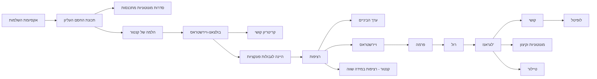

# מפת תלות משפטים - אינפי 1

<!-- codex-enhanced: 2026-07-10 -->

> מטרה: לראות את הקורס כרשת אחת. כשמשפט לא ברור, הולכים אחורה בגרף עד שמוצאים את ההנחה שנשברה.

## גרף על

## שלושה צירי תלות

| ציר | מתחיל ב | עובר דרך | מגיע אל |
|---|---|---|---|
| שלמות | [[אקסיומת השלמות]] | [[סדרות מונוטוניות]], [[הלמה של קנטור]] | [[משפט בולצאנו-ויירשטראס]], [[סדרות קושי]] |
| קומפקטיות בקטע | [[רציפות בקטע]] | [[משפט ערך הביניים]], [[משפטי ויירשטראס]] | [[רציפות במידה שווה ומשפט קנטור]] |
| נגזרת | [[הגדרת הנגזרת]] | [[נקודות קיצון ומשפט פרמה]], [[משפט רול]] | [[משפט לגראנז]], [[משפט קושי]], [[כלל לופיטל]], [[משפט טיילור]] |

## איך להשתמש במפה

1. לפני הוכחה: סמנו איזה משפט רוצים להפעיל ומה תנאיו.
2. אם תנאי חסר: חזרו צעד אחד אחורה בגרף וחפשו משפט שמספק אותו.
3. אם הטענה נשמעת שגויה: עברו ל[[אינדקס דוגמאות נגד - אינפי 1]] וחפשו דוגמה ששוברת תנאי.
4. אם צריך לכתוב הוכחה מלאה: עברו ל[[תבניות הוכחה באינפי 1]] ובחרו פרוטוקול.

## קשרים

- [[אינפי 1 - מפת הקורס]]
- [[תבניות הוכחה באינפי 1]]
- [[אינדקס דוגמאות נגד - אינפי 1]]
