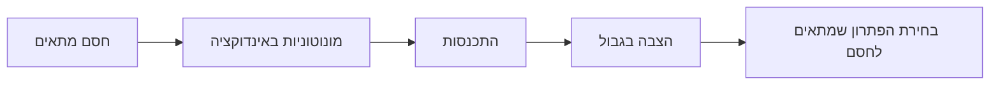

# תבניות הוכחה באינפי 1

<!-- codex-enhanced: 2026-07-10 -->

## גבול סדרה לפי ההגדרה

1. יהי $\varepsilon>0$.
2. מנתחים את $|a_n-L|<\varepsilon$ עד שמקבלים תנאי מספיק על $n$.
3. בוחרים $N\in\mathbb N$ בעזרת [[תכונת ארכימדס והחלק השלם]].
4. מוכיחים שלכל $n\ge N$ מתקיים האי-שוויון.

## גבול פונקציה לפי $\varepsilon$-$\delta$

1. יהי $\varepsilon>0$.
2. מחפשים חסם מהצורה $|f(x)-L|\le C|x-x_0|$ או פירוק שמוביל אליו.
3. בוחרים $\delta$ כך ש-$0<|x-x_0|<\delta$ יספיק.
4. מסיימים בלי להשתמש בערך $f(x_0)$ אלא אם רציפות נבדקת.

## הוכחת sup

כדי להראות $s=\sup A$:

1. מוכיחים $a\le s$ לכל $a\in A$.
2. מוכיחים שלכל $\varepsilon>0$ קיים $a\in A$ כך ש-$s-\varepsilon<a$.

## סדרה רקורסיבית

## משפטי קטע סגור

לפני שמפעילים [[משפט ערך הביניים]], [[משפטי ויירשטראס]] או [[רציפות במידה שווה ומשפט קנטור]]:

1. התחום חייב להיות קטע סגור וחסום $[a,b]$.
2. הפונקציה חייבת להיות רציפה על כל הקטע, כולל קצוות חד-צדדיים.
3. המסקנה היא קיום; יחידות או נוסחה דורשות טיעון נוסף.

## שרשרת הנגזרת

1. קיצון פנימי + גזירות -> [[נקודות קיצון ומשפט פרמה]].
2. פרמה + ערכים שווים בקצוות -> [[משפט רול]].
3. רול על פונקציית עזר -> [[משפט לגראנז]].
4. לגראנז' לשתי פונקציות -> [[משפט קושי]].
5. קושי + גבול מנת נגזרות -> [[כלל לופיטל]].

## בחירת כלי לגבול

| מצב | כלי ראשון |
|---|---|
| ביטוי אלגברי | פירוק/צמצום/רציונליזציה |
| ביטוי חסום כפול קטן | [[סדרות חסומות וסדרות אפסות]] או סנדוויץ' |
| $\sin x/x$ או זווית קטנה | [[הגבול של sin x חלקי x]] |
| צורת $0/0$ או $\infty/\infty$ | [[כלל לופיטל]] אחרי בדיקת תנאים |
| צריך דיוק סדר גבוה | [[משפט טיילור]] |

## קשרים

- [[מפת תלות משפטים - אינפי 1]]
- [[אינדקס דוגמאות נגד - אינפי 1]]
- [[אינפי 1 - מפת הקורס]]
