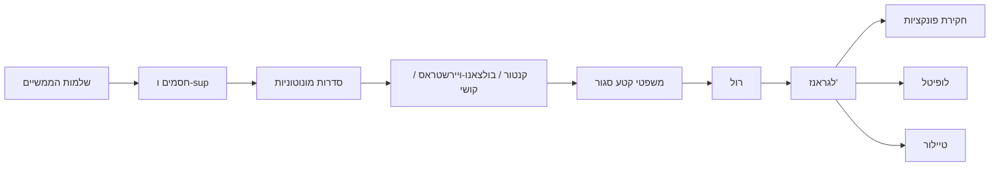

# 🗺️ חשבון אינפיניטסימלי 1 — מפת הקורס

> מבוסס על ספרי הקורס 20474 של האוניברסיטה הפתוחה (ד"ר גיל אלון): כרך א (יחידות 1–3), כרך ב (יחידות 4–6), כרך ג (יחידות 7–8), חוברת "הגדרות ומשפטים", ובנוסף [[סיכום צנזור - מפת ההרצאות|סיכום הרצאות אינפי 1מ (טכניון)]]. מספרי המשפטים בפתקים תואמים את חוברת ההגדרות והמשפטים. שגיאות דפוס: [[תיקונים לספרי הקורס]].

<!-- codex-enhanced: 2026-07-10 -->

## כלי למידה רוחביים

- [[מפת תלות משפטים - אינפי 1]] - לראות מי נשען על מי.
- [[תבניות הוכחה באינפי 1]] - פרוטוקולים להוכחות $\varepsilon$, sup, קטע סגור, נגזרת וטיילור.
- [[אינדקס דוגמאות נגד - אינפי 1]] - דוגמאות שמונעות הכללות שגויות.

## חוט השדרה של הקורס

**[[אקסיומת השלמות]]** ⟶ [[חסמים - חסם עליון ותחתון|תכונת החסם העליון]] ⟶ [[סדרות מונוטוניות|מונוטונית+חסומה מתכנסת]] ⟶ [[הלמה של קנטור]] ⟶ [[משפט בולצאנו-ויירשטראס]] ⟶ [[סדרות קושי|קריטריון קושי]] ⟶ משפטי הקטע הסגור: [[משפט ערך הביניים]], [[משפטי ויירשטראס]], [[רציפות במידה שווה ומשפט קנטור|קנטור]] ⟶ ובעזרת [[נקודות קיצון ומשפט פרמה|פרמה]]: [[משפט רול|רול]] ⟶ [[משפט לגראנז|לגראנז']] ⟶ כל תורת חקירת הפונקציות.

---

## כרך א

### יחידה 1 — המספרים הממשיים
- [[קבוצות, יחסים ופעולות]] · [[אינדוקציה מתמטית]]
- [[מערכות מספרים - מהטבעיים לממשיים]] · [[אקסיומות השדה והסדר]]
- [[ערך מוחלט ומרחק]] · [[קטעים וסביבות]]
- **[[אקסיומת השלמות]]** · [[תכונת ארכימדס והחלק השלם]] · [[צפיפות הרציונליים]]
- [[אי-שוויון הממוצעים]]

### יחידה 2 — סדרות וגבולות
- [[סדרות - מושגי יסוד]] · **[[גבול של סדרה]]** · [[סדרות חסומות וסדרות אפסות]]
- כלי חישוב: [[אריתמטיקה של גבולות סדרות]] · [[כללי סדר ומשפט הסנדוויץ]]
- [[גבולות במובן הרחב]] · [[סדרי גודל ומבחן המנה]] · [[משפטי צזארו - סדרות ממוצעים]]

### יחידה 3 — קבוצות וסדרות חסומות
- **[[חסמים - חסם עליון ותחתון]]** · **[[סדרות מונוטוניות]]** · [[ייצוג עשרוני של מספרים ממשיים]]
- [[הלמה של קנטור]] · [[תת-סדרות וגבולות חלקיים]] · **[[משפט בולצאנו-ויירשטראס]]**
- [[סדרות קושי]] · [[גבול עליון וגבול תחתון]]

## כרך ב

### יחידה 4 — גבולות של פונקציות
- [[פונקציות ממשיות - מושגי יסוד]] · [[פונקציות אלמנטריות]]
- **[[גבול של פונקציה בנקודה]]** (סביבות / ε–δ / היינה)
- [[אריתמטיקה וכללים לגבולות פונקציות]] · [[הגבול של sin x חלקי x]]
- [[גבולות חד-צדדיים]] · [[גבולות אינסופיים וגבולות באינסוף]]

### יחידה 5 — פונקציות רציפות
- **[[רציפות בנקודה]]** · [[פונקציית דיריכלה]] · [[מיון נקודות אי-רציפות]]
- [[רציפות בקטע]] ⟶ שלושת הגדולים: **[[משפט ערך הביניים]]** · **[[משפטי ויירשטראס]]** · **[[רציפות במידה שווה ומשפט קנטור]]**
- [[פונקציות מונוטוניות ופונקציה הפוכה רציפה]] (כולל arcsin, arccos, arctan)

### יחידה 6 — פונקציות מעריכיות
- [[חזקות רציונליות וממשיות]] · [[פונקציות מעריכיות ולוגריתמיות]] · **[[המספר e]]**

## כרך ג

### יחידה 7 — הנגזרת
- **[[הגדרת הנגזרת]]** (מהירות, משיק; גזירות⟹רציפות) · [[נגזרות חד-צדדיות]]
- [[כללי הגזירה]] · **[[כלל השרשרת]]** · [[נגזרת הפונקציה ההפוכה]]
- [[נגזרות הפונקציות האלמנטריות]] · [[קירוב ליניארי והדיפרנציאל]]

### יחידה 8 — תכונות של פונקציות גזירות
- [[נקודות קיצון ומשפט פרמה]] ⟶ **[[משפט רול]]** ⟶ **[[משפט לגראנז]]** ⟶ [[משפט קושי]]
- [[משפט דארבו]] · **[[כלל לופיטל]]**
- חקירה: [[מונוטוניות ומיון נקודות קיצון]] · [[קמירות ונקודות פיתול]] · [[אסימפטוטות וחקירת פונקציה]]

## נושאים משלימים (מסיכום הצנזור)
- **[[משפט טיילור]]** · [[הלמה של היינה-בורל]] · [[סיכום צנזור - מפת ההרצאות]]

---

## שבעת המשפטים שחייבים לדעת להוכיח

1. [[סדרות מונוטוניות|מונוטונית וחסומה מתכנסת]] (3.16)
2. [[משפט בולצאנו-ויירשטראס]] (3.32)
3. [[סדרות קושי|קריטריון קושי]] (3.36)
4. [[משפט ערך הביניים]] (5.29/5.31)
5. [[משפטי ויירשטראס]] (5.35, 5.37)
6. [[משפט רול]] + [[משפט לגראנז]] (8.5–8.6)
7. [[נקודות קיצון ומשפט פרמה|משפט פרמה]] (8.4)

## אינדקס דוגמאות-נגד קלאסיות

| דוגמה | מפריכה את... | פתק |
|---|---|---|
| $(-1)^n$ | חסומה ⟹ מתכנסת | [[גבול של סדרה]] |
| $\sqrt{n}$ | $a_{n+1}-a_n\to0$ ⟹ קושי | [[סדרות קושי]] |
| $D(x)$ דיריכלה | "פונקציות רציפות בדרך כלל" | [[פונקציית דיריכלה]] |
| $\frac1x$ על $(0,1)$ | ויירשטראס/קנטור בקטע פתוח | [[משפטי ויירשטראס]] |
| $x^2$ על $\mathbb{R}$ | רציפה ⟹ במ"ש | [[רציפות במידה שווה ומשפט קנטור]] |
| $\|x\|$ | רציפה ⟹ גזירה | [[הגדרת הנגזרת]] |
| $x^3$ ב-0 | $f'=0$ ⟹ קיצון | [[נקודות קיצון ומשפט פרמה]] |
| $x^2\sin\frac1x$ | גזירה ⟹ נגזרת רציפה; וגם גבול לופיטל | [[משפט דארבו]], [[כלל לופיטל]] |
| $e^{-1/x^2}$ | טור טיילור מתכנס לפונקציה | [[משפט טיילור]] |
