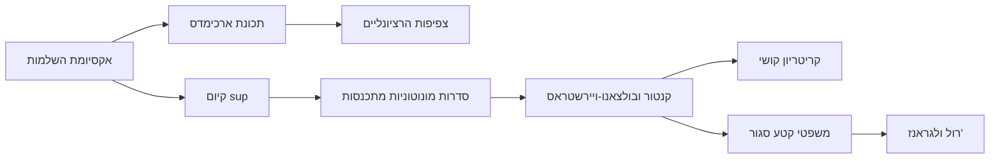

# אקסיומת השלמות

> מקור: כרך א, פרק 1.5 (אקסיומה 1.52, משפט 1.53, מסקנה 1.55, הגדרה 1.56)

## ניסוח (אקסיומה 1.52)

אם $A, B$ קבוצות לא ריקות של ממשיים כך שלכל $a\in A$ ולכל $b\in B$ מתקיים $a \le b$, אז קיים $x$ ממשי **מפריד**:
$$a \le x \le b \quad \text{לכל } a\in A,\ b\in B$$

### קריאה איטית של הניסוח

- הדרישה היא שכל $A$ "משמאל" לכל $B$ — כל איבר של $A$ קטן-או-שווה מכל איבר של $B$. לא מספיק שחלק מהאיברים מסודרים כך.
- המסקנה: קיימת נקודה בתפר. ייתכן ש-$x\in A$, ייתכן $x\in B$, ייתכן שאינו באף אחת — האקסיומה מבטיחה קיום בלבד.
- המפריד **אינו בהכרח יחיד**: ל-$A=\{0\},\ B=\{1\}$ כל $x\in[0,1]$ מפריד. יחידות מתקבלת רק כשהקבוצות "צמודות" (למשל בבניית שורש, להלן).

### האינטואיציה

אם כל $A$ משמאל לכל $B$, אין "חור" ביניהם — תמיד יש מספר ממשי בתפר. **זו התכונה שנכשלת ב-$\mathbb{Q}$**: הקבוצות
$$A=\{q\in\mathbb{Q},\ q>0 : q^2<2\}, \qquad B=\{q\in\mathbb{Q},\ q>0 : q^2>2\}$$
מקיימות את התנאי (כל איבר של $A$ קטן מכל איבר של $B$), אבל שום רציונלי אינו מפריד ביניהן: מפריד $x$ היה חייב לקיים $x^2=2$ (אם $x^2<2$ אפשר למצוא רציונלי מעט גדול ממנו שעדיין ב-$A$, בסתירה להפרדה; וסימטרית ל-$x^2>2$), ו-$\sqrt2\notin\mathbb{Q}$ לפי משפט 1.21 ב[[מערכות מספרים - מהטבעיים לממשיים]]. לכן השלמות היא אקסיומה אמיתית — היא לא נובעת מ[[אקסיומות השדה והסדר]], שהרי $\mathbb{Q}$ מקיים את כולן.

## תוצאה ראשונה: קיום שורשים (משפט 1.53, מסקנה 1.55)

**משפט 1.53**: לכל $c>0$ קיים $x>0$ יחיד עם $x^2=c$. **מסקנה 1.55**: לכל $c>0$ ולכל $n$ טבעי קיים $x>0$ **יחיד** עם $x^n=c$; מסמנים $x=\sqrt[n]{c}$ (הגדרה 1.56).

**מהלך ההוכחה (למקרה $x^2=c$)** — מדגים את תבנית השימוש הקלאסית באקסיומה:

1. **מגדירים שתי קבוצות**: $A=\{t>0: t^2<c\}$, $B=\{t>0: t^2>c\}$.
2. **לא ריקות**: $\min\{c,1\}/2\in A$ (בדיקה ישירה), $c+1\in B$ (כי $(c+1)^2>c$).
3. **מופרדות**: אם $a\in A,\ b\in B$ אז $a^2<c<b^2$, ומחיוביות $a<b$ (אחרת $a\ge b>0$ גורר $a^2\ge b^2$).
4. **האקסיומה נותנת מפריד** $x$ עם $a\le x\le b$ לכל $a\in A,\ b\in B$.
5. **שלילת שתי האפשרויות האחרות**: אם $x^2<c$, מראים שקיים $\delta>0$ קטן עם $(x+\delta)^2<c$ (בוחרים $\delta<\frac{c-x^2}{2x+1},\ \delta\le1$, ואז $(x+\delta)^2=x^2+\delta(2x+\delta)\le x^2+\delta(2x+1)<c$) — אז $x+\delta\in A$ אבל $x+\delta>x$, בסתירה לכך ש-$x$ חסם מלעיל של $A$. באופן סימטרי $x^2>c$ נפסל. נשאר $x^2=c$. ∎
6. **יחידות**: משמרות הסדר של העלאה בריבוע על החיוביים: $0<x_1<x_2 \Rightarrow x_1^2<x_2^2$.

**התבנית לזכירה**: רוצים להוכיח שקיים מספר עם תכונה? בונים את "כל מי שקטן מדי" מול "כל מי שגדול מדי", מפרידים, ומוכיחים שהמפריד הוא בדיוק המבוקש. אותה תבנית חוזרת בהוכחת [[חסמים - חסם עליון ותחתון|תכונת החסם העליון]].

## הגלגולים של השלמות לאורך הקורס

אקסיומת השלמות היא המנוע של **כל** משפטי הקיום בקורס. שרשרת התוצאות:

1. [[תכונת ארכימדס והחלק השלם|תכונת ארכימדס]] (משפט 1.60)
2. [[צפיפות הרציונליים]] (משפט 1.66)
3. **תכונת החסם העליון** (משפט 3.6): לכל קבוצה לא-ריקה וחסומה מלעיל יש sup — [[חסמים - חסם עליון ותחתון]]. זהו הניסוח השקול והשימושי ביותר של השלמות.
4. **סדרה מונוטונית וחסומה מתכנסת** (משפט 3.16) — [[סדרות מונוטוניות]]
5. [[הלמה של קנטור]] (משפט 3.22) — קטעים מקוננים
6. [[משפט בולצאנו-ויירשטראס]] (משפט 3.32)
7. [[סדרות קושי|קריטריון קושי]] (משפט 3.36)
8. ובהמשך על פונקציות: [[משפט ערך הביניים]], [[משפטי ויירשטראס]], [[רציפות במידה שווה ומשפט קנטור|משפט קנטור]], ודרך [[משפט רול|רול]] — [[משפט לגראנז|לגראנז']] וכל חקירת הפונקציות.

כל אחד מהם הוא למעשה ניסוח מחדש של "אין חורים בציר". בלי השלמות — אף אחד מהם לא נכון, ולכל אחד יש דוגמה נגדית מעל $\mathbb{Q}$ (למשל: הסדרה המונוטונית והחסומה $1, 1.4, 1.41, 1.414,\dots$ של קטיעות $\sqrt2$ אינה מתכנסת ב-$\mathbb{Q}$; הפונקציה $f(q)=q^2-2$ מחליפה סימן על $[0,2]\cap\mathbb{Q}$ בלי להתאפס).

## איך מזהים במבחן ששאלה "נוגעת בשלמות"

- מבקשים להוכיח **קיום** של מספר (שורש, גבול, נקודת חיתוך) בלי נוסחה מפורשת.
- מופיעות המילים sup/inf, מונוטונית וחסומה, קטעים מקוננים, תת-סדרה מתכנסת, קושי.
- שאלת "הפרכה מעל $\mathbb{Q}$": מתבקשת דוגמה נגדית — כמעט תמיד בונים אותה סביב $\sqrt2$.

## כרטיס דיוק

- **רעיון-על**: שלמות היא החומר שמונע "חורים" בציר: בין שתי קבוצות מופרדות תמיד יש נקודת תפר ממשית.
- **מתי מפעילים**: כשצריך לעבור מקירובים או חסמים לקיום מספר ממשי מוגדר.
- **בדיקה עצמית**: (א) שחזרו את בניית $\sqrt2$ כמפריד. (ב) הסבירו למה המפריד לא תמיד יחיד, ומתי כן. (ג) תנו שלוש דוגמאות נגדיות מעל $\mathbb{Q}$ למשפטים מהרשימה.
- **מלכודת**: לא כל חסם מלעיל הוא חסם עליון; החסם העליון הוא הקטן מבין החסמים מלעיל. וכן: האקסיומה נותנת קיום, לא יחידות ולא שיטת חישוב.
- **קישור רוחב**: ראו גם [[מפת תלות משפטים - אינפי 1]], [[תבניות הוכחה באינפי 1]], [[אינדקס דוגמאות נגד - אינפי 1]].

## תרשים תלות

## קשרים

- [[אקסיומות השדה והסדר]] — שתי קבוצות האקסיומות האחרות
- [[חסמים - חסם עליון ותחתון]] — הניסוח השקול והשימושי ביותר
- [[מערכות מספרים - מהטבעיים לממשיים]] — הכשל של $\mathbb{Q}$ שהאקסיומה מתקנת
- [[אי-שוויון הממוצעים]] — משתמש בקיום שורשים
- [[הלמה של קנטור]], [[משפט בולצאנו-ויירשטראס]], [[סדרות קושי]] — צאצאיה הישירים ביחידה 3
