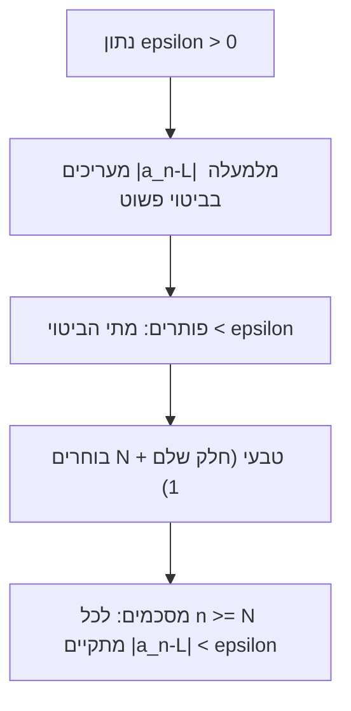

# גבול של סדרה

> מקור: כרך א, פרק 2.2 (הגדרות 2.8–2.15, טענות 2.10–2.14, משפטים 2.12, 2.16–2.18)

## ההגדרה (2.9)

$\{a_n\}$ **מתכנסת** ל-$L$ אם לכל $\varepsilon > 0$, כמעט כל איברי הסדרה נמצאים ב[[קטעים וסביבות|סביבת]]-$\varepsilon$ של $L$. במפורש:

$$\lim_{n\to\infty} a_n = L \iff \forall \varepsilon>0\ \exists N\in\mathbb{N}:\ \forall n\ge N,\ |a_n - L| < \varepsilon$$

סדרה שאינה מתכנסת לשום $L$ נקראת **מתבדרת**.

### איך לקרוא את זה

- $\varepsilon$ — "דרישת הדיוק" של יריב: כמה קרוב צריך להיות ל-$L$. היריב רשאי לבחור כל דיוק, קטן ככל שירצה.
- $N$ — התשובה שלנו: מאיזה מקום בסדרה **כל** האיברים עומדים בדרישה.
- **הסדר קובע**: קודם נתון $\varepsilon$, ואז מוצאים $N$ — לכן $N$ רשאי (וכמעט תמיד חייב) להיות תלוי ב-$\varepsilon$. דיוק קשוח יותר ⟸ צריך ללכת רחוק יותר בסדרה.
- "כמעט כל" ([[סדרות - מושגי יסוד|הגדרה 2.5]]): רק מספר סופי של איברים מותר להם לחרוג. לכן שינוי/מחיקת רישא סופית לא משנה כלום.
- המשחק חייב להצליח **לכל** $\varepsilon$: הצלחה עבור $\varepsilon=0.1$ בלבד לא מוכיחה כלום.

### ההגדרה השלולה (חובה לדעת לנסח!)

$\{a_n\}$ **אינה** מתכנסת ל-$L$:
$$\exists\varepsilon>0\ \forall N\ \exists n\ge N:\ |a_n-L|\ge\varepsilon$$
כלומר: יש דיוק $\varepsilon$ שבו הסדרה נכשלת שוב ושוב — אינסוף איברים במרחק $\ge\varepsilon$ מ-$L$. שימו לב איך כל כמת התהפך. ניסוח שלילה נכון הוא שאלת מבחן קלאסית ותנאי לכל הוכחת התבדרות.

## דוגמה עבודה מלאה — הוכחה מן ההגדרה

**טענה**: $\lim\dfrac{3n+1}{n}=3$.

**הוכחה**: יהי $\varepsilon>0$. נעריך:
$$\left|\frac{3n+1}{n}-3\right| = \left|\frac{1}{n}\right| = \frac1n.$$
נדרוש $\frac1n<\varepsilon$, כלומר $n>\frac1\varepsilon$. לפי [[תכונת ארכימדס והחלק השלם|ארכימדס]] נבחר $N=\left\lfloor\frac1\varepsilon\right\rfloor+1$. אז לכל $n\ge N$: $\frac1n\le\frac1N<\varepsilon$. ∎

שימו לב לשלושת השלבים הקבועים: **פישוט הביטוי ⟵ פתירת אי-השוויון עבור $n$ ⟵ בחירת $N$ טבעי מפורש**. כשהביטוי לא מסתדר לפתרון מדויק — מעריכים מלמעלה ("הגדל מונה, הקטן מכנה", [[אקסיומות השדה והסדר|יחידה 1]]) עד שמתקבל חסם נוח כמו $\frac Cn$.

## דוגמאות ראשונות

- $\lim \frac1n = 0$ (טענה 2.10) — נובע מ[[תכונת ארכימדס והחלק השלם|ארכימדס]]: בהינתן $\varepsilon$ ניקח $N > 1/\varepsilon$. זה "הגבול האטומי" שממנו נבנים כל האחרים.
- סדרה קבועה $a_n=c$ מתכנסת ל-$c$ (טענה 2.11) — כל $N$ עובד.
- $\{(-1)^n\}$ **מתבדרת** (טענה 2.14). הוכחה בתבנית השלילה: לכל מועמד $L$ ניקח $\varepsilon=\tfrac12$; מכיוון שהמרחק בין $1$ ל-$-1$ הוא $2$, לא ייתכן ששניהם בסביבת $\tfrac12$ של $L$, ושניהם מופיעים אינסוף פעמים — לכן לכל $N$ יש $n\ge N$ עם $|a_n-L|\ge\tfrac12$. ∎

## יחידות הגבול (משפט 2.12)

אם $a_n \to L_1$ וגם $a_n \to L_2$ אז $L_1 = L_2$. לכן מותר לומר "**ה**גבול" ולכתוב $\lim a_n$.

**הוכחה**: נניח $L_1\ne L_2$ וניקח $\varepsilon=\frac{|L_1-L_2|}{2}$. כמעט כל האיברים בסביבת-$\varepsilon$ של $L_1$ וגם כמעט כולם בסביבת-$\varepsilon$ של $L_2$; אבל שתי הסביבות **זרות** ([[קטעים וסביבות]]), ולא ייתכן שכמעט-כל האיברים בשתי קבוצות זרות בו-זמנית (איבר שנמצא בשתיהן — סתירה; ויש כזה כי שני ה"כמעט כל" חופפים החל מ-$\max(N_1,N_2)$). ∎

## סדרה מתכנסת חסומה (משפט 2.16)

**כל סדרה מתכנסת היא [[סדרות חסומות וסדרות אפסות|חסומה]].**

**הוכחה**: ניקח $\varepsilon=1$; קיים $N$ כך שמ-$N$ ואילך $|a_n-L|<1$, כלומר $|a_n|<|L|+1$ (אי-שוויון המשולש). האיברים שלפני $N$ הם מספר סופי, ולכן חסומים על-ידי $\max\{|a_1|,\dots,|a_{N-1}|\}$. ניקח $M=\max\{|a_1|,\dots,|a_{N-1}|,\ |L|+1\}$. ∎

(ההפך לא נכון: $\{(-1)^n\}$ חסומה ומתבדרת. ההשלמה החלקית: [[משפט בולצאנו-ויירשטראס]] — לחסומה יש תת-סדרה מתכנסת.) שימוש עיקרי: **הפרכה** — סדרה לא חסומה מתבדרת מיד, בלי שום חישוב.

## עמידות הגבול (משפטים 2.17, 2.29)

שינוי מספר סופי של איברים או הזזה ($b_n=a_{n+s}$) — לא משנים התכנסות ולא את ערך הגבול. התכנסות היא תכונת **זנב**.

## דרכים להוכיח התבדרות — סיכום כלים

1. הסדרה לא חסומה (משפט 2.16).
2. שני [[תת-סדרות וגבולות חלקיים|גבולות חלקיים]] שונים (כמו $(-1)^n$) — הכלי הנוח ביותר בדרך כלל.
3. ישירות מהשלילה של ההגדרה.
4. הסדרה אינה [[סדרות קושי|קושי]].

## איך מוכיחים גבול מן ההגדרה — תבנית

1. נתון $\varepsilon>0$ שרירותי.
2. מפשטים/מעריכים את $|a_n-L|$ מלמעלה בביטוי פשוט ב-$n$ (בעזרת [[ערך מוחלט ומרחק|כללי ערך מוחלט]]).
3. פותרים את אי-השוויון עבור $n$ ובוחרים $N$ מתאים ([[תכונת ארכימדס והחלק השלם|ארכימדס/חלק שלם]]).
4. מסכמים: לכל $n\ge N$ מתקיים $|a_n-L|<\varepsilon$.

**הערות סגנון שחוסכות נקודות**: מותר להעריך ביד גסה — לא מחפשים את $N$ הקטן ביותר, רק אחד שעובד; מותר להניח $n\ge n_0$ קבוע כלשהו מראש (מוסיפים אותו ל-$N$ בסוף); ואסור להתחיל מ-$|a_n-L|<\varepsilon$ ולעבוד "אחורה" בלי לוודא שכל המעברים הפיכים.

## כרטיס דיוק

- **רעיון-על**: גבול הוא חוזה: לכל דיוק שנדרש, יש מקום שממנו והלאה כל הזנב עומד בו.
- **מתי מפעילים**: הוכחת התכנסות מהגדרה, הוכחת יחידות, תרגום "כמעט כל" ל-$N$, והוכחות התבדרות דרך השלילה.
- **בדיקה עצמית**: (א) הוכיחו מההגדרה $\frac{n}{n+1}\to1$ עם $N$ מפורש. (ב) כתבו את שלילת ההגדרה בלי להציץ. (ג) הוכיחו ש-$(-1)^n$ מתבדרת ישירות מהשלילה.
- **מלכודת**: הסדר הכמותי קריטי — $N$ תלוי ב-$\varepsilon$, לא להפך; ובדיקת $\varepsilon$ בודד אינה הוכחה.
- **קישור רוחב**: ראו גם [[מפת תלות משפטים - אינפי 1]], [[תבניות הוכחה באינפי 1]], [[אינדקס דוגמאות נגד - אינפי 1]].

## תרשים עבודה

## קשרים

- [[סדרות - מושגי יסוד]] — "כמעט כל", זנב, הזזות
- [[אריתמטיקה של גבולות סדרות]] — חישוב גבולות בלי אפסילונים
- [[כללי סדר ומשפט הסנדוויץ]] — השוואות בין גבולות
- [[גבולות במובן הרחב]] — שאיפה ל-$\pm\infty$
- [[סדרות מונוטוניות]] — קריטריון התכנסות בלי לדעת את הגבול
- [[סדרות קושי]] — קריטריון פנימי להתכנסות
- [[תת-סדרות וגבולות חלקיים]] — כלי ההתבדרות המרכזי
- [[גבול של פונקציה בנקודה]] — ההכללה לפונקציות; הגדרת היינה מחזירה אותנו לסדרות
