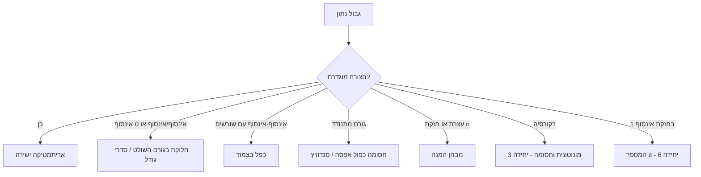

# שער יחידה 2 - סדרות וגבולות

## מה היחידה הזאת עושה

כאן מוגדר המושג המרכזי של כל הקורס: **גבול**. ההגדרה הכמותית ($\varepsilon$–$N$) היא הטכנולוגיה שמאפשרת לומר "מתקרב ל-" בלי ידיים מנופפות, וסביבה נבנה ארגז כלים שלם: אריתמטיקה, סנדוויץ', חסומה×אפסה, מבחן המנה, צזארו. מי ששולט ביחידה הזאת יודע שני דברים: **להוכיח** גבול מן ההגדרה, ו**לחשב** גבול עם הכלי הנכון בסדר הנכון.

## ציר לימוד

1. [[סדרות - מושגי יסוד]] — סדרה כפונקציה, זנב, "כמעט לכל"
2. **[[גבול של סדרה]]** — ההגדרה, השלילה שלה, יחידות, מתכנסת⟹חסומה
3. [[סדרות חסומות וסדרות אפסות]] — חסומה×אפסה ולמה 2.26
4. [[אריתמטיקה של גבולות סדרות]] — כללי החישוב והוכחותיהם
5. [[כללי סדר ומשפט הסנדוויץ]] — השוואות וכליאה
6. [[גבולות במובן הרחב]] — $\pm\infty$ וצורות בלתי-מוגדרות
7. [[סדרי גודל ומבחן המנה]] — הסולם: לוג < פולינום < מעריכי < עצרת
8. [[משפטי צזארו - סדרות ממוצעים]] — ממוצעים יורשים גבול

## עץ ההחלטה לחישוב גבול סדרה



## שלוש נקודות שנבחנים נופלים בהן

1. **שלילת ההגדרה**: להוכיח התבדרות צריך $\exists\varepsilon\,\forall N\,\exists n\ge N$ — לא "ההגדרה לא עובדת לי".
2. **אריתמטיקה רק כשהחלקים מתכנסים**: אסור לפרק $\lim(a_n+b_n)$ לפני שמוודאים ששני הגבולות קיימים.
3. **אי-שוויון חד נחלש בגבול**: מ-$a_n<b_n$ מסיקים $\lim a_n\le\lim b_n$ בלבד.

## דיאגרמת יחידה

```tikz
\begin{document}
\begin{tikzpicture}[x=0.38cm,y=2.0cm]
  \draw[->] (0,0) -- (23,0) node[right] {$n$};
  \draw[->] (0,-0.1) -- (0,1.35) node[above] {$a_n$};
  \draw[red,dashed] (0,1) -- (23,1) node[right] {$L$};
  \draw[red,dotted] (0,1.18) -- (23,1.18) node[right] {$L+\varepsilon$};
  \draw[red,dotted] (0,0.82) -- (23,0.82) node[right] {$L-\varepsilon$};
  \fill[blue] (1,0.35) circle (1.8pt);
  \fill[blue] (2,1.55) circle (1.8pt);
  \fill[blue] (3,0.62) circle (1.8pt);
  \fill[blue] (4,1.32) circle (1.8pt);
  \fill[blue] (5,0.78) circle (1.8pt);
  \fill[blue] (6,1.21) circle (1.8pt);
  \fill[blue] (7,0.88) circle (1.8pt);
  \fill[blue] (8,1.12) circle (1.8pt);
  \fill[blue] (9,0.94) circle (1.8pt);
  \fill[blue] (10,1.08) circle (1.8pt);
  \fill[blue] (12,0.97) circle (1.8pt);
  \fill[blue] (14,1.05) circle (1.8pt);
  \fill[blue] (16,0.99) circle (1.8pt);
  \fill[blue] (18,1.03) circle (1.8pt);
  \fill[blue] (20,1.00) circle (1.8pt);
  \draw[green,very thick] (10,0) -- (22,0);
  \node[green,below] at (10,0) {$N$};
  \node at (14,1.32) {$n>N \Rightarrow |a_n-L|<\varepsilon$};
\end{tikzpicture}
\end{document}
```

## Dataview

```dataview
TABLE WITHOUT ID file.link AS "פתק", join(file.tags, ", ") AS "תגים"
FROM "יחידה 2 - סדרות וגבולות"
WHERE file.name != this.file.name
SORT file.name ASC
```

## בדיקת שליטה

- להוכיח מההגדרה $\frac{n}{n+1}\to1$ עם $N$ מפורש, ולנסח את שלילת ההגדרה.
- להוכיח שסדרה מתכנסת חסומה (רישא סופית + זנב).
- לחשב: $\sqrt{n^2+n}-n$ (צמוד), $\frac{\sin n}{n}$ (חסומה×אפסה), $\sqrt[n]{2^n+3^n}$ (סנדוויץ'), $\frac{5^n}{n!}$ (מבחן המנה).
- לזהות מתי סנדוויץ' חזק יותר מאריתמטיקת גבולות ולמה.
- להבדיל בין גבול רגיל לגבול במובן הרחב, ובין "לא חסומה" ל"שואפת לאינסוף".
- למנות את הצורות הבלתי-מוגדרות ולתת שתי דוגמאות מנוגדות ל-$\infty-\infty$.

## חזרה

- [[כרטיסי חזרה - אינפי 1]]
- [[כספת העל - אינפי 1]]
- [[אינפי 1 - מפת הקורס]]
