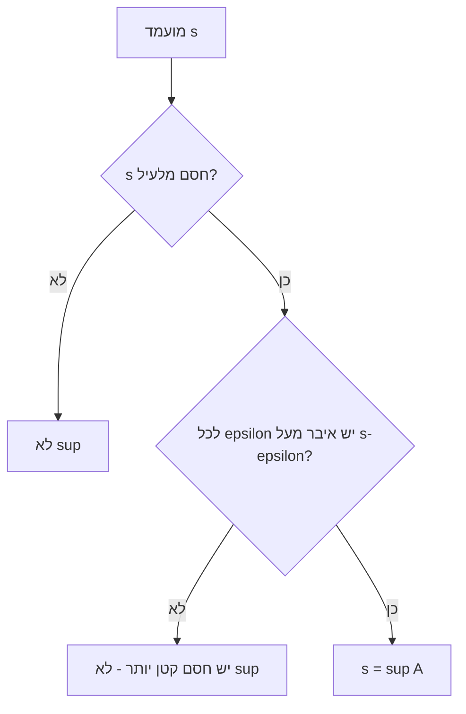

# חסמים: חסם עליון (sup) וחסם תחתון (inf)

> מקור: כרך א, פרק 3.1 (הגדרות 3.1–3.12, משפטים 3.6, 3.11, טענות 3.8–3.14)

## חסם מלעיל ומלרע (הגדרה 3.1)

עבור $A \subseteq \mathbb{R}$:
- $c$ **חסם מלעיל** של $A$ אם $a \le c$ לכל $a \in A$; אם קיים כזה — $A$ **חסומה מלעיל**.
- $c$ **חסם מלרע** אם $c \le a$ לכל $a\in A$; אם קיים — **חסומה מלרע**.
- **חסומה** (3.2): גם וגם; שקול ל-$\exists M: |x|\le M$ לכל $x\in A$ (טענה 3.3).

חסם מלעיל אינו יחיד — אם $c$ חסם, גם כל מה שמעליו חסם. לקטע $(0,1)$ החסמים מלעיל הם $[1,\infty)$ כולו. השאלה המעניינת: האם בקבוצת החסמים יש **קטן ביותר**?

## תכונת החסם העליון (משפט 3.6) — לב היחידה

**לכל קבוצה לא ריקה וחסומה מלעיל יש חסם מלעיל מינימלי.**

הוא נקרא **החסם העליון** (סוּפְּרֶמוּם) ומסומן $\sup A$ (הגדרה 3.7). באופן סימטרי (משפט 3.11, הגדרה 3.12): לקבוצה לא-ריקה חסומה מלרע יש **חסם תחתון** (אינפימום) $\inf A$.

**הוכחה (מ[[אקסיומת השלמות]])**: תהי $B$ קבוצת כל החסמים מלעיל של $A$. שתי הקבוצות לא ריקות ($A$ בהנחה; $B$ כי $A$ חסומה מלעיל), ולכל $a\in A,\ b\in B$: $a\le b$ (הגדרת חסם). לפי אקסיומת השלמות קיים מפריד $x$: $a\le x\le b$ לכל $a,b$. מהצד השמאלי — $x$ חסם מלעיל של $A$, כלומר $x\in B$; מהצד הימני — $x$ קטן-או-שווה מכל איבר של $B$, כלומר הוא **המינימלי** ב-$B$. ∎

שימו לב לשני תנאי הקיום — **לא ריקה** ו**חסומה מלעיל** — שניהם הכרחיים: ל-$\varnothing$ כל מספר הוא חסם מלעיל (באופן ריק) ואין מינימלי; ל-$\mathbb{N}$ אין חסם מלעיל בכלל ([[תכונת ארכימדס והחלק השלם|ארכימדס]]). למעשה, תכונת החסם העליון **שקולה** לאקסיומת השלמות — ורוב ההוכחות בהמשך משתמשות דווקא בה. ב-$\mathbb{Q}$ היא נכשלת: ל-$\{q\in\mathbb{Q}: q^2<2\}$ אין sup רציונלי.

## האפיון העבודתי של sup (טענה 3.9)

$y = \sup A$ אם ורק אם:
1. $y$ חסם מלעיל של $A$: $\ \forall a\in A,\ a\le y$
2. לכל $\varepsilon>0$ קיים $x \in A$ עם $x > y - \varepsilon$ — שום דבר קטן מ-$y$ אינו חסם

התנאי השני = "יש איברי $A$ קרובים ל-sup כרצוננו". **מסקנה בונת-סדרות** (בשימוש בלתי פוסק): אם $y=\sup A$, אז לכל $n$ יש $x_n\in A$ עם $x_n>y-\frac1n$, ומסנדוויץ' $x_n\to y$ — כלומר **תמיד קיימת סדרה בתוך $A$ ששואפת ל-$\sup A$**. זה הגשר בין עולם הקבוצות לעולם הסדרות, והוא הצעד הראשון בהוכחות רבות (למשל [[משפטי ויירשטראס]]).

האפיון המקביל ל-inf: $y=\inf A$ $\iff$ $y$ חסם מלרע ולכל $\varepsilon>0$ יש $x\in A$ עם $x<y+\varepsilon$.

## sup לעומת max

- אם ל-$A$ יש מקסימום אז $\sup A = \max A$ (טענה 3.8); בדומה $\inf A=\min A$ (3.13).
- אבל sup קיים גם בלי מקסימום: $\sup(0,1)=1 \notin (0,1)$, $\ \inf\{\frac1n : n\in\mathbb{N}\}=0\notin$ הקבוצה.
- ההבחנה: $\sup A\in A \iff$ יש מקסימום. וזה כל היתרון של sup: **קיום מובטח** לכל קבוצה חסומה לא-ריקה (למקסימום — לא).

### דוגמאות מחושבות

| קבוצה | inf | min | sup | max |
|---|---|---|---|---|
| $[0,1]$ | 0 | 0 | 1 | 1 |
| $(0,1)$ | 0 | — | 1 | — |
| $\{\frac1n\}_{n\ge1}$ | 0 | — | 1 | 1 |
| $\{x: x^2<2\}$ | $-\sqrt2$ | — | $\sqrt2$ | — |
| $\mathbb{N}$ | 1 | 1 | — | — |

**תרגיל הוכחה טיפוסי** ($\sup(0,1)=1$): (א) $1$ חסם מלעיל — ברור מההגדרה. (ב) לכל $\varepsilon>0$ (אפשר להניח $\varepsilon<1$), המספר $1-\frac\varepsilon2$ שייך ל-$(0,1)$ וגדול מ-$1-\varepsilon$. שני חלקי האפיון מתקיימים. ∎

## תכונות נוספות

- **חיבור קבוצות** (טענה 3.10): $\sup(A+B) = \sup A + \sup B$, כאשר $A+B=\{a+b : a\in A, b\in B\}$.
- **שיקוף** (טענה 3.14): $\inf(-A) = -\sup A$ — לכן כל משפט על sup מתורגם אוטומטית ל-inf; מספיק להוכיח הכול ל-sup.
- **מונוטוניות**: $A\subseteq B$ (חסומות) $\Rightarrow \sup A\le\sup B$ וגם $\inf A\ge\inf B$ — קבוצה גדולה יותר נמתחת לשני הכיוונים.

## איך מוכיחים ש-$y=\sup A$ — תבנית

1. **חסם**: מראים $a\le y$ לכל $a\in A$ (אלגברה/אי-שוויונות).
2. **מינימליות**: נתון $\varepsilon>0$, בונים **איבר מפורש** של $A$ שגדול מ-$y-\varepsilon$. (או בשלילה: מניחים חסם $c<y$ ומגיעים לסתירה.)

טעות נפוצה: להסתפק ב"נראה שאי-אפשר פחות" בלי לבנות איבר. תנאי 2 דורש עד.

## כרטיס דיוק

- **רעיון-על**: sup הוא תחליף ל-max כשהמקסימום לא מושג; הוא נקודת המגע בין סדר לשלמות, וקיומו הוא הצורה השימושית ביותר של אקסיומת השלמות.
- **מתי מפעילים**: קבוצה חסומה בלי מקסימום ברור; בניית איברים כמעט-מקסימליים; ובניית סדרה ששואפת ל-sup.
- **בדיקה עצמית**: (א) הוכיחו במלואו $\sup(0,1)=1$. (ב) הוכיחו את משפט 3.6 מהאקסיומה. (ג) בנו סדרה בתוך $\{x:x^2<2\}$ ששואפת ל-$\sqrt2$.
- **מלכודת**: חסם עליון חייב לחסום את **כל** הקבוצה; איבר גדול "כמעט מכולם" לא מספיק. ו-sup אינו בהכרח איבר של הקבוצה.
- **קישור רוחב**: ראו גם [[מפת תלות משפטים - אינפי 1]], [[תבניות הוכחה באינפי 1]], [[אינדקס דוגמאות נגד - אינפי 1]].

## תרשים sup

## קשרים

- [[אקסיומת השלמות]] — המקור; תכונת החסם העליון שקולה לה
- [[תכונת ארכימדס והחלק השלם]] — מוכחת דרך sup
- [[סדרות מונוטוניות]] — עולה וחסומה מתכנסת ל-$\sup\{a_n\}$
- [[גבול עליון וגבול תחתון]] — limsup/liminf של סדרה
- [[משפטי ויירשטראס]] — פונקציה רציפה בקטע סגור מקבלת sup כמקסימום
