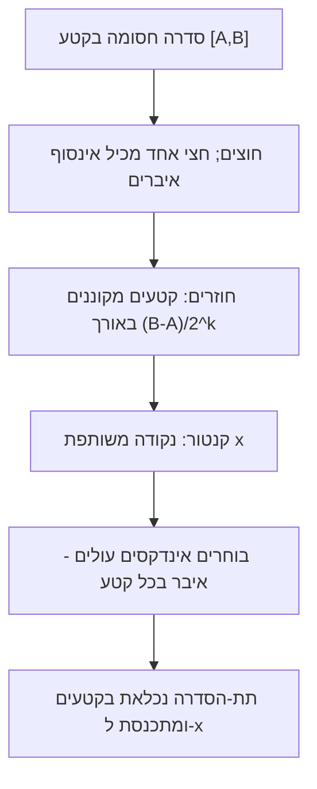

# משפט בולצאנו–ויירשטראס

> מקור: כרך א, סעיף 3.3.5 (משפט 3.32, מסקנה 3.33, משפט 3.34)

## המשפט (3.32)

**לכל סדרה חסומה יש תת-סדרה מתכנסת.**

ובניסוח גבולות חלקיים: לכל סדרה חסומה יש לפחות [[תת-סדרות וגבולות חלקיים|גבול חלקי]] אחד (סופי).

## הוכחה מלאה — חצייה + קנטור (משפט חובה למבחן)

הסדרה חסומה: כל איבריה בקטע $I_0=[A,B]$.

**שלב 1 — בניית קטעים מקוננים.** נחצה את $I_0$ לשני חצאים שווים. לפחות אחד מהם מכיל $a_n$ עבור **אינסוף** אינדקסים $n$ (אילו בשניהם היו רק סופיים — גם באיחוד, סתירה). נבחר חצי כזה ונקרא לו $I_1$. נמשיך באינדוקציה: $I_{k+1}$ הוא חצי של $I_k$ המכיל אינסוף איברי סדרה. מתקבלת סדרת קטעים סגורים מקוננים עם $|I_k| = \frac{B-A}{2^k}\to0$.

**שלב 2 — קנטור.** לפי [[הלמה של קנטור]] קיימת נקודה יחידה $x\in\bigcap I_k$.

**שלב 3 — בניית תת-הסדרה.** נבחר $n_1$ עם $a_{n_1}\in I_1$. בהינתן $n_k$, נבחר $n_{k+1}>n_k$ עם $a_{n_{k+1}}\in I_{k+1}$ — אפשרי כי ב-$I_{k+1}$ יש איברים עם **אינסוף** אינדקסים, ובפרט גדולים מ-$n_k$. (זו בדיוק הנקודה שבה "אינסוף איברים" הכרחי — "לפחות איבר אחד" לא היה מספיק לבחירה אינסופית עולה!)

**שלב 4 — התכנסות.** $a_{n_k}$ ו-$x$ שניהם ב-$I_k$, לכן $|a_{n_k}-x|\le|I_k|=\frac{B-A}{2^k}\to0$, כלומר $a_{n_k}\to x$. ∎

*(דרך חלופית שקיימת בספרות: לכל סדרה יש תת-סדרה מונוטונית — דרך "נקודות פסגה" — ואז [[סדרות מונוטוניות|משפט 3.16]]. הקורס הולך בדרך החצייה.)*

## הרחבות

- **מסקנה 3.33**: לכל סדרה (גם לא חסומה) יש תת-סדרה מתכנסת **במובן הרחב**: אם לא חסומה מלעיל — יש תת-סדרה $\to\infty$ (בוחרים $a_{n_k}>k$ באינדוקציה); בדומה מלרע.
- **משפט 3.34 — אפיון ההתכנסות**: סדרה **חסומה** מתכנסת $\iff$ יש לה גבול חלקי **יחיד**. כיוון ⟸ הוא הלא-טריוויאלי: אם חסומה לא מתכנסת ל-$L$ (הגבול החלקי), יש $\varepsilon$ ואינסוף איברים מחוץ לסביבת $L$; הם עצמם סדרה חסומה, ב"ו נותן להם גבול חלקי — שני, שונה מ-$L$. סתירה.
  **החסימות חיונית**: $a_n = n\cdot(1+(-1)^n)/2$ (כלומר $0,2,0,4,0,6,\dots$)? לה שני גבולות חלקיים. ניקח במקום: $0,1,0,2,0,3,\dots$ — גבול חלקי סופי יחיד ($0$) והיא מתבדרת (לא חסומה). בלי חסימות, גבול חלקי יחיד לא מספיק.

## מה המשפט באמת אומר

חסימות היא "דחיסת אינסוף איברים בקופסה סופית" — הם **חייבים להצטופף** סביב נקודה כלשהי. אין לאן לברוח: או שמתפזרים לאינסוף (אסור, חסומה) או שנערמים. זהו ביטוי ה**קומפקטיות** של קטע סגור — התכונה שהופכת את $[a,b]$ לזירה הנוחה של האנליזה — ועוד שקילות של [[אקסיומת השלמות]] (ב-$\mathbb{Q}$: קטיעות $\sqrt2$ חסומות ובלי גבול חלקי רציונלי).

## צרכני המשפט בהמשך הקורס

- [[סדרות קושי|קריטריון קושי]] (3.36) — סדרת קושי חסומה; ב"ו נותן גבול חלקי; תכונת קושי גוררת שכל הסדרה נגררת אליו.
- [[משפטי ויירשטראס]] (5.35, 5.37) — פעמיים: חסימות פונקציה רציפה (בשלילה, דרך סדרה) ולכידת נקודת מקסימום.
- [[רציפות במידה שווה ומשפט קנטור|משפט קנטור]] (5.61) — בשלילה, בונים שתי סדרות מתקרבות ומפעילים ב"ו.
- [[גבול עליון וגבול תחתון]] — קיום limsup/liminf לחסומה (משפט 3.38).

**תבנית השימוש האופיינית**: "יש לי סדרה שנבנתה בשלילה / מבחירת נקודות; היא חסומה (כי התחום חסום); אז יש תת-סדרה מתכנסת $x_{n_k}\to c$; עכשיו מפעילים רציפות/היינה על $c$ ומגיעים לסתירה או למבוקש." — כך נראות ההוכחות ביחידה 5.

## כרטיס דיוק

- **רעיון-על**: אינסוף איברים בקופסה חסומה חייבים להצטופף — לפחות מסלול מתכנס אחד מובטח.
- **מתי מפעילים**: סדרה חסומה בלי מונוטוניות; הוכחות-בשלילה על קטע סגור; וכל מקום שצריך "לחלץ" תת-סדרה מתכנסת.
- **בדיקה עצמית**: (א) שחזרו את ההוכחה, והסבירו איפה בדיוק נדרש "אינסוף איברים" (ולא "לפחות אחד"). (ב) הוכיחו את מסקנה 3.33 לסדרה לא חסומה. (ג) תנו דוגמה שמפריכה את 3.34 בלי חסימות.
- **מלכודת**: המשפט לא אומר שהסדרה מתכנסת — רק שיש לה תת-סדרה מתכנסת; ואפיון 3.34 דורש חסימות.
- **קישור רוחב**: ראו גם [[מפת תלות משפטים - אינפי 1]], [[תבניות הוכחה באינפי 1]], [[אינדקס דוגמאות נגד - אינפי 1]].

## תרשים הוכחה

## קשרים

- [[הלמה של קנטור]] — מנוע ההוכחה
- [[תת-סדרות וגבולות חלקיים]] — השפה; משפט 3.34
- [[סדרות קושי]] — הצרכן המיידי הבא
- [[משפטי ויירשטראס]], [[רציפות במידה שווה ומשפט קנטור]] — הצרכנים ביחידה 5
- [[הלמה של היינה-בורל]] — משפט קומפקטיות מקביל (צנזור)
- [[אקסיומת השלמות]] — השורש
