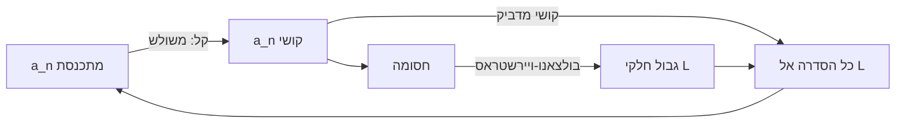

# סדרות קושי וקריטריון קושי

> מקור: כרך א, סעיף 3.3.6 (הגדרה 3.35, משפט 3.36)

## תנאי קושי (הגדרה 3.35)

$\{a_n\}$ מקיימת את **תנאי קושי** אם:
$$\forall\varepsilon>0\ \exists N\in\mathbb{N}:\ \forall m,n\ge N,\quad |a_m - a_n| < \varepsilon$$

כלומר: מאיזשהו שלב, **כל שני איברים** (לא רק עוקבים!) קרובים זה לזה עד כדי $\varepsilon$. סדרה כזו נקראת **סדרת קושי**. ניסוח שקול ונוח: לכל $\varepsilon>0$ קיים $N$ כך שלכל $n\ge N$ ולכל $p\ge1$: $|a_{n+p}-a_n|<\varepsilon$ — "המרחק מכל איבר עתידי, רחוק ככל שיהיה, קטן מ-$\varepsilon$".

### ⚠️ המלכודת המפורסמת של הקורס

לא מספיק ש-$|a_{n+1}-a_n|\to0$! **דוגמת הדגל**: $a_n=\sqrt n$. מתקיים
$$a_{n+1}-a_n=\sqrt{n+1}-\sqrt n=\frac{1}{\sqrt{n+1}+\sqrt n}\to0,$$
אבל הסדרה אינה קושי: עבור $m=4n$, $\ a_m-a_n=2\sqrt n-\sqrt n=\sqrt n\to\infty$ — ההפרשים הקטנים **מצטברים**. (וכן $a_n=\sum_{k=1}^n\frac1k$, הטור ההרמוני: צעדים $\frac1n\to0$ וסכום לאינסוף — בודקים עם $|a_{2n}-a_n|\ge n\cdot\frac{1}{2n}=\frac12$.) תנאי קושי דורש שליטה על $|a_m-a_n|$ לכל **זוג** — לא רק שכנים.

## קריטריון קושי (משפט 3.36)

**סדרה מתכנסת $\iff$ היא סדרת קושי.**

### הוכחה מלאה

**(⇐) מתכנסת ⟹ קושי.** נניח $a_n\to L$. יהי $\varepsilon>0$; קיים $N$ כך שלכל $n\ge N$: $|a_n-L|<\frac\varepsilon2$. אז לכל $m,n\ge N$:
$$|a_m-a_n| \le |a_m-L|+|L-a_n| < \tfrac\varepsilon2+\tfrac\varepsilon2 = \varepsilon. \ ∎$$
(שוב אי-שוויון המשולש עם פיצול $\varepsilon$ — [[ערך מוחלט ומרחק]].)

**(⇒) קושי ⟹ מתכנסת — הכיוון העמוק.**

*שלב 1: קושי חסומה.* עבור $\varepsilon=1$ יש $N$ כך שלכל $n\ge N$: $|a_n-a_N|<1$, כלומר $|a_n|<|a_N|+1$; עם הרישא הסופית — חסומה (כמו בהוכחת [[גבול של סדרה|משפט 2.16]]).

*שלב 2: יש גבול חלקי.* לפי [[משפט בולצאנו-ויירשטראס]] יש תת-סדרה $a_{n_k}\to L$.

*שלב 3: כל הסדרה נגררת אל $L$.* יהי $\varepsilon>0$. מקושי: קיים $N_1$ כך שלכל $m,n\ge N_1$: $|a_m-a_n|<\frac\varepsilon2$. מהתכנסות התת-סדרה: קיים $k$ עם $n_k\ge N_1$ ו-$|a_{n_k}-L|<\frac\varepsilon2$. אז לכל $n\ge N_1$:
$$|a_n-L| \le |a_n-a_{n_k}|+|a_{n_k}-L| < \tfrac\varepsilon2+\tfrac\varepsilon2=\varepsilon. \ ∎$$

**סיכום הרעיון**: קושי ⟹ חסומה ⟹ (ב"ו) גבול חלקי ⟹ (קושי שוב) כולם צמודים לתת-הסדרה ⟹ גבול מלא. שימו לב שקושי משמש **פעמיים**.

## המשמעות העקרונית

זהו קריטריון התכנסות **פנימי לחלוטין**: לא צריך לנחש את הגבול ולא צריך מונוטוניות ([[סדרות מונוטוניות|השוו למשפט 3.16]]) — רק להשוות איברי הסדרה לעצמם. שלושת קריטריוני ההתכנסות של הקורס, בסדר כלליות עולה:

| קריטריון | דורש | נותן |
|---|---|---|
| הגדרת הגבול | מועמד $L$ | הכול |
| מונוטונית+חסומה | מונוטוניות | קיום גבול = sup |
| **קושי** | כלום (פנימי) | קיום גבול |

הכיוון הקשה שקול ל[[אקסיומת השלמות]]: ב-$\mathbb{Q}$ יש סדרות קושי בלי גבול (קטיעות עשרוניות של $\sqrt2$: קושי כי ההפרשים $<10^{-n}$, בלי גבול רציונלי) — הגבול "חסר". שלמות = "כל סדרת קושי מתכנסת". (זו גם הדרך האלטרנטיבית **לבנות** את $\mathbb{R}$ בקורסים מתקדמים.)

## שימוש טיפוסי — הפרשים דועכים הנדסית

אם $|a_{n+1}-a_n| \le c\, q^n$ עם $0<q<1$, אז לכל $m>n$ (טלסקופ + סכום הנדסי):
$$|a_m-a_n| \le \sum_{k=n}^{m-1}|a_{k+1}-a_k| \le c\sum_{k=n}^{\infty}q^k = \frac{c\,q^n}{1-q} \xrightarrow[n\to\infty]{} 0$$
— קושי, ולכן מתכנסת, בלי שום מושג מה הגבול. כך מטפלים בסדרות "מתכווצות" (כמו $a_{n+1}=\cos(a_n)$ ודומותיה) ובטורים עם דעיכה הנדסית. **התבנית**: הפרש-שכנים קטן גאומטרית ⟹ טלסקופ ⟹ קושי.

ולהפרכה: כדי להראות שסדרה אינה מתכנסת, מספיק למצוא $\varepsilon$ וזוגות $m,n$ גדולים כרצוננו עם $|a_m-a_n|\ge\varepsilon$ (כמו $|a_{2n}-a_n|\ge\frac12$ בטור ההרמוני).

## כרטיס דיוק

- **רעיון-על**: קושי מודד התכנסות מבפנים — צפיפות הדדית של הזנב במקום קרבה לגבול חיצוני.
- **מתי מפעילים**: גבול לא ניתן לניחוש; הפרשים דועכים גאומטרית; הוכחת התבדרות של טורים ($|a_{2n}-a_n|$); ודיוני שלמות.
- **בדיקה עצמית**: (א) הוכיחו ששני הכיוונים של 3.36. (ב) הראו ש-$\sqrt n$ אינה קושי אף ש-$a_{n+1}-a_n\to0$. (ג) הוכיחו התכנסות כש-$|a_{n+1}-a_n|\le2^{-n}$.
- **מלכודת**: $|a_{n+1}-a_n|\to0$ אינו תנאי קושי — צריך כל זוג, לא רק שכנים.
- **קישור רוחב**: ראו גם [[מפת תלות משפטים - אינפי 1]], [[תבניות הוכחה באינפי 1]], [[אינדקס דוגמאות נגד - אינפי 1]].

## תרשים לוגי

## קשרים

- [[משפט בולצאנו-ויירשטראס]] — לב הכיוון הקשה
- [[אקסיומת השלמות]] — השקילות העמוקה
- [[גבול של סדרה]] — ההגדרה שהקריטריון מייתר
- [[ערך מוחלט ומרחק]] — אי-שוויון המשולש בשני הכיוונים
- [[סדרות מונוטוניות]] — הקריטריון המקביל בעולם המונוטוני
- [[גבולות אינסופיים וגבולות באינסוף|תנאי קושי לפונקציות]] — גרסה לגבול פונקציה (בסיכום צנזור)
