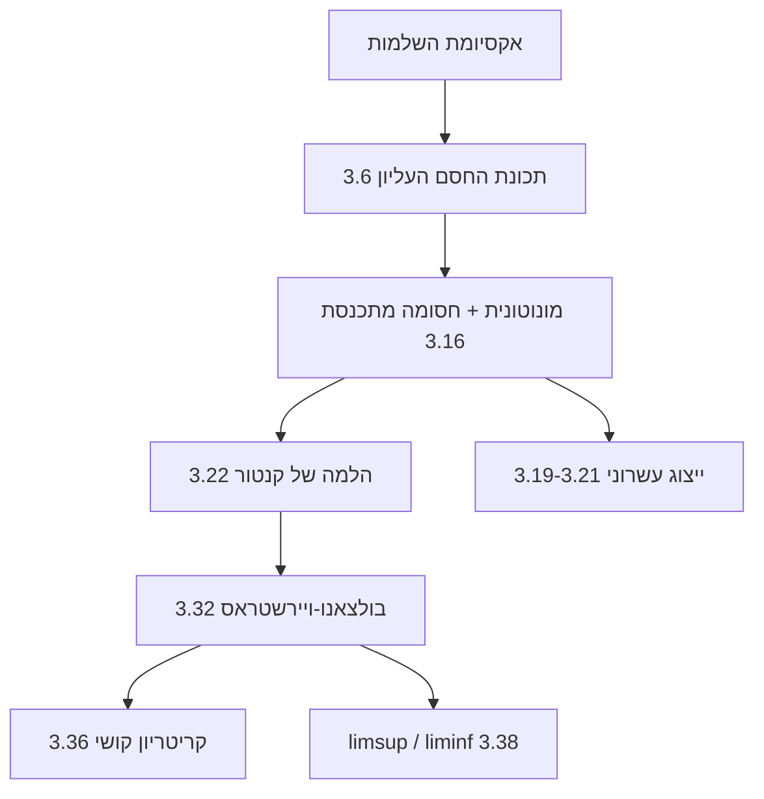

# שער יחידה 3 - חסמים וגבולות חלקיים

## מה היחידה הזאת עושה

זו היחידה שבה [[אקסיומת השלמות]] מתפרקת לכלים מעשיים. השרשרת: **שלמות ⟵ sup ⟵ מונוטונית+חסומה מתכנסת ⟵ קנטור ⟵ בולצאנו-ויירשטראס ⟵ קושי** — כל חוליה מוכחת מהקודמת, וכולן יחד הן ארגז משפטי הקיום שכל יחידות ההמשך (5, 8) יישענו עליו. שלושה מתוך "שבעת משפטי החובה להוכחה" של הקורס נמצאים כאן: 3.16, 3.32, 3.36.

## ציר לימוד

1. **[[חסמים - חסם עליון ותחתון]]** — sup/inf: קיום, אפיון, ובניית סדרות אל ה-sup
2. **[[סדרות מונוטוניות]]** — משפט 3.16 ותבנית הסדרות הרקורסיביות
3. [[ייצוג עשרוני של מספרים ממשיים]] — יישום ראשון: משמעות לשבר אינסופי
4. [[הלמה של קנטור]] — קטעים מקוננים ושיטת החצייה
5. [[תת-סדרות וגבולות חלקיים]] — השפה: מסלולים ויעדים
6. **[[משפט בולצאנו-ויירשטראס]]** — חסומה ⟹ תת-סדרה מתכנסת
7. **[[סדרות קושי]]** — הקריטריון הפנימי
8. [[גבול עליון וגבול תחתון]] — limsup/liminf: מעטפת ההתנהגות

## שרשרת התלות



## שלוש נקודות שנבחנים נופלים בהן

1. **הצבת גבול ברקורסיה לפני הוכחת קיום** — קודם חסימות+מונוטוניות, רק אחר-כך $L=f(L)$.
2. **$|a_{n+1}-a_n|\to0$ אינו קושי** — $\sqrt n$ והטור ההרמוני הם דוגמאות הנגד; קושי דורש כל זוג $m,n$.
3. **גבול חלקי ≠ גבול** — "אינסוף איברים בסביבה" מול "כמעט כולם"; תת-סדרה מתכנסת אחת אינה מוכיחה התכנסות.

## דיאגרמת יחידה

```tikz
\begin{document}
\begin{tikzpicture}[x=1cm,y=1cm]
  \draw[->] (-0.4,0) -- (7.4,0) node[right] {$R$};
  \draw[blue,very thick] (0.4,0.25) -- (7,0.25);
  \fill[blue] (0.4,0.25) circle (2pt);
  \fill[blue] (7,0.25) circle (2pt);
  \node[blue,above] at (3.7,0.25) {$I_1$};

  \draw[green,very thick] (1.1,-0.35) -- (6.2,-0.35);
  \fill[green] (1.1,-0.35) circle (2pt);
  \fill[green] (6.2,-0.35) circle (2pt);
  \node[green,above] at (3.65,-0.35) {$I_2$};

  \draw[red,very thick] (2.0,-0.95) -- (5.1,-0.95);
  \fill[red] (2.0,-0.95) circle (2pt);
  \fill[red] (5.1,-0.95) circle (2pt);
  \node[red,above] at (3.55,-0.95) {$I_3$};

  \draw[black,very thick] (3.05,-1.55) -- (3.85,-1.55);
  \fill[black] (3.05,-1.55) circle (2pt);
  \fill[black] (3.85,-1.55) circle (2pt);
  \node[above] at (3.45,-1.55) {$I_n$};

  \draw[dashed] (3.45,0.55) -- (3.45,-1.85);
  \node[below] at (3.45,-1.85) {$c$};
  \node at (5.6,1.0) {$I_1\supset I_2\supset I_3\supset \cdots$};
\end{tikzpicture}
\end{document}
```

## Dataview

```dataview
TABLE WITHOUT ID file.link AS "פתק", join(file.tags, ", ") AS "תגים"
FROM "יחידה 3 - חסמים וגבולות חלקיים"
WHERE file.name != this.file.name
SORT file.name ASC
```

## בדיקת שליטה

- להוכיח במלואם את שלושת משפטי החובה: מונוטונית וחסומה (3.16), בולצאנו-ויירשטראס (3.32), קריטריון קושי (3.36).
- להריץ את תבנית הסדרה הרקורסיבית על $a_1=\sqrt2,\ a_{n+1}=\sqrt{2+a_n}$ מא' עד ת'.
- להסביר למה כל אחד מהמשפטים נכשל מעל $\mathbb{Q}$, עם דוגמה מפורשת סביב $\sqrt2$.
- לחשב limsup/liminf של $(-1)^n(1+\frac1n)$ ולנמק מהאפיון.
- להסביר למה $0.999\dots=1$ דרך הגדרת הערך כגבול.

## חזרה

- [[כרטיסי חזרה - אינפי 1]]
- [[כספת העל - אינפי 1]]
- [[אינפי 1 - מפת הקורס]]
