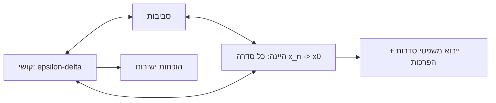

# גבול של פונקציה בנקודה

> מקור: כרך ב, פרק 4.2 (הגדרות 4.26–4.32, משפטים 4.30–4.31)

## שלוש הגדרות שקולות

תהי $f$ מוגדרת ב[[קטעים וסביבות|סביבה מנוקבת]] של $x_0$. הערך $f(x_0)$ עצמו — **לא רלוונטי**, ואפילו לא חייב להיות מוגדר! (הדוגמה הקנונית: $\frac{\sin x}{x}$ ב-$0$.)

### 1. הגדרת הסביבות (4.27)

$\lim_{x\to x_0} f(x) = L$ אם לכל סביבה $N_\varepsilon(L)$ קיימת סביבה מנוקבת $N^*_\delta(x_0)$ כך ש-$x \in N^*_\delta(x_0) \Rightarrow f(x) \in N_\varepsilon(L)$.

### 2. הגדרת $\varepsilon$–$\delta$ (קושי) (4.28)

$$\forall \varepsilon>0\ \exists \delta>0:\quad 0 < |x-x_0| < \delta \implies |f(x)-L| < \varepsilon$$

איך לקרוא: היריב דורש דיוק פלט $\varepsilon$; אנחנו עונים בדיוק קלט $\delta$ (התלוי ב-$\varepsilon$, ולרוב גם ב-$x_0$) שמבטיח אותו. שימו לב ל-$0<|x-x_0|$: זו ה**נקיבה** — לא בודקים את $x_0$ עצמו. השוו ל[[גבול של סדרה]]: התפקיד של $N$ עובר ל-$\delta$, ו"מכאן ואילך" הופך ל"קרוב מספיק".

### 3. הגדרת היינה (סדרות) (4.29)

לכל סדרה $x_n \to x_0$ עם $x_n \ne x_0$ לכל $n$, מתקיים $f(x_n) \to L$. ("**כל** דרך התקרבות נותנת אותו יעד.")

**משפט 4.30**: ההגדרות שקולות. (הכיוון היינה⟸קושי בשלילה הוא הטיעון היפה: אם קושי נכשלת, יש $\varepsilon$ שעבורו לכל $\delta=\frac1n$ קיים $x_n$ "רע" — והסדרה $\{x_n\}$ מפרה את היינה.) **משפט 4.31**: הגבול, אם קיים, יחיד.

## דוגמה עבודה — הוכחת $\varepsilon$–$\delta$ מלאה

**טענה**: $\lim_{x\to2}x^2=4$. יהי $\varepsilon>0$. נעריך:
$$|x^2-4| = |x-2|\,|x+2|.$$
נגביל מראש $|x-2|<1$, ואז $1<x<3$ ולכן $|x+2|<5$. נבחר $\delta=\min\left\{1,\ \frac\varepsilon5\right\}$: אם $0<|x-2|<\delta$ אז
$$|x^2-4| = |x-2||x+2| < \frac\varepsilon5\cdot5 = \varepsilon. \ ∎$$

**התבנית הקבועה**: מבודדים גורם $|x-x_0|$, חוסמים את הגורם הנותר על-ידי הגבלה מוקדמת ($\delta\le1$), ובוחרים $\delta$ כמינימום. ה-$\min$ בסוף הוא סימן ההיכר של הוכחות $\varepsilon$–$\delta$ נכונות.

## מתי משתמשים בכל הגדרה

- **$\varepsilon$–$\delta$**: הוכחות ישירות שגבול קיים ושווה ל-$L$; והוכחות משפטים כלליים.
- **היינה**: הגשר אל [[גבול של סדרה|תורת הסדרות]] — כל משפטי יחידות 2–3 מיובאים חינם (אריתמטיקה, סנדוויץ', חסומה×אפסה...). ובעיקר: **הכלי להוכחת אי-קיום גבול**.
- **סביבות**: הניסוח המאוחד שמכליל בלי שינוי לכל סוגי הגבולות ([[גבולות אינסופיים וגבולות באינסוף|אינסופיים, באינסוף]], [[גבולות חד-צדדיים|חד-צדדיים]]).

### הפרכת גבול בשיטת שתי הסדרות (היינה)

**דוגמה קנונית**: ל-$f(x)=\sin\frac1x$ אין גבול ב-$0$. ניקח
$$x_n=\frac{1}{2\pi n} \to 0: \quad f(x_n)=\sin(2\pi n)=0 \to 0$$
$$y_n=\frac{1}{2\pi n+\frac\pi2} \to 0: \quad f(y_n)=\sin\left(2\pi n+\tfrac\pi2\right)=1 \to 1$$
שתי דרכי התקרבות, שני יעדים — אין גבול. ∎ (הפונקציה "מתנדנדת אינסוף פעמים" בכל סביבה של 0; השוו: $x\sin\frac1x\to0$ כן קיים — האמפליטודה נמחצת.)

באותה שיטה: ל[[פונקציית דיריכלה]] אין גבול באף נקודה (סדרה רציונלית מול אי-רציונלית, בזכות [[צפיפות הרציונליים]]).

## תכונות בסיסיות

- **לוקאליות** (טענה 4.34): הגבול תלוי רק בהתנהגות בסביבה מנוקבת כלשהי — שתי פונקציות המזדהות ליד $x_0$ (חוץ אולי מ-$x_0$) — אותו גבול. **זה מה שמכשיר צמצומים**: $\frac{x^2-1}{x-1}$ ו-$x+1$ מזדהות בסביבה מנוקבת של $1$, לכן לגבול מותר לצמצם.
- לפונקציה ליניארית: $\lim_{x\to x_0}(ax+b) = ax_0+b$ (טענה 4.33; עם $\delta=\frac{\varepsilon}{|a|}$ — המקרה הנקי היחיד שבו $\delta$ לא תלוי ב-$x_0$).
- **החלפת משתנה בסיסית** (טענה 4.40): $\lim_{x\to x_0}f(x)$ קיים $\iff \lim_{h\to0}f(x_0+h)$ קיים, ואז שווים. זו הצורה שבה כתובה [[הגדרת הנגזרת]].
- קיום גבול סופי ⟹ $f$ **חסומה בסביבה מנוקבת** של $x_0$ (המקבילה של "מתכנסת⟹חסומה").

## המשך הסיפור

- כלים לחישוב: [[אריתמטיקה וכללים לגבולות פונקציות]]
- גבול מצד אחד: [[גבולות חד-צדדיים]] — וקיום גבול ⟺ שני החד-צדדיים קיימים ושווים
- $L=\pm\infty$ או $x\to\pm\infty$: [[גבולות אינסופיים וגבולות באינסוף]]
- כשהגבול קיים ושווה לערך הפונקציה: [[רציפות בנקודה]]
- גבול של מנת שינויים: [[הגדרת הנגזרת]]

## כרטיס דיוק

- **רעיון-על**: גבול פונקציה = יעד אחיד לכל דרכי ההתקרבות; שלוש ההגדרות הן שלוש שפות לאותו חוזה.
- **מתי מפעילים**: $\varepsilon$–$\delta$ להוכחות ישירות; היינה לייבוא ממשפטי סדרות ולהפרכות; סביבות להכללות.
- **בדיקה עצמית**: (א) הוכיחו ב-$\varepsilon$–$\delta$: $\lim_{x\to3}x^2=9$ (עם הגבלה מוקדמת ו-min). (ב) הפריכו קיום גבול של $\cos\frac1x$ ב-0 בשתי סדרות. (ג) נסחו את שלילת הגדרת קושי.
- **מלכודת**: ערך הפונקציה בנקודה אינו קובע את הגבול — רק ההתנהגות בסביבה מנוקבת; וב-$\delta$ מותר (וכמעט תמיד צריך) לתלות ב-$\varepsilon$ וב-$x_0$.
- **קישור רוחב**: ראו גם [[מפת תלות משפטים - אינפי 1]], [[תבניות הוכחה באינפי 1]], [[אינדקס דוגמאות נגד - אינפי 1]].

## תרשים שלוש הגדרות

## קשרים

- [[קטעים וסביבות]] — סביבה מנוקבת
- [[גבול של סדרה]] — היינה מחבר בין העולמות
- [[אריתמטיקה וכללים לגבולות פונקציות]] — כלי החישוב
- [[גבולות חד-צדדיים]], [[גבולות אינסופיים וגבולות באינסוף]] — ההרחבות
- [[פונקציית דיריכלה]] — אי-קיום גבול בכל נקודה
- [[הגבול של sin x חלקי x]] — הגבול המפורסם של היחידה
- [[רציפות בנקודה]] — הצעד הבא
