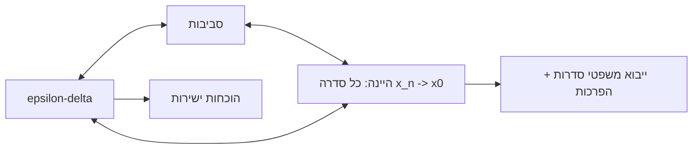

# גבול של פונקציה בנקודה

> מקור: כרך ב, פרק 4.2 (הגדרות 4.26–4.29, 4.32; משפטים 4.30–4.31; טענות 4.33, 4.34, 4.40)

## שלוש הגדרות שקולות

תהי $f$ מוגדרת ב[[קטעים וסביבות|סביבה מנוקבת]] של $x_0$. הערך $f(x_0)$ עצמו — **לא רלוונטי**, ואפילו לא חייב להיות מוגדר! (הדוגמה הקנונית: $\frac{\sin x}{x}$ ב-$0$.)

### 1. הגדרת הסביבות (4.27)

$\lim_{x\to x_0} f(x) = L$ אם לכל סביבה $N_\varepsilon(L)$ קיימת סביבה מנוקבת $N^*_\delta(x_0)$ כך ש-$x \in N^*_\delta(x_0) \Rightarrow f(x) \in N_\varepsilon(L)$.

> [!simple]- במילים פשוטות: בודקים סביב הנקודה
> **בשורה אחת**: הגבול מתאר לאן מגיעים ערכי הפונקציה כשמתקרבים לקלט מסוים, בלי לבדוק דווקא את הקלט עצמו.
>
> **תמונה בראש**: מתקרבים לכתובת מכל הרחובות הסמוכים. מה שנמצא בכתובת עצמה אינו קובע את הדרך אליה.
>
> **עם מספרים**: אם $f(x)=x+2$ לכל $x\ne1$, אז הגבול ב-$1$ הוא $3$, גם אם נגדיר $f(1)=100$ או לא נגדיר אותו כלל.
>
> **סביבה מנוקבת**: למשל סביבת $1$ ברדיוס $0.1$ היא $(0.9,1.1)$, ובגרסה המנוקבת מוציאים ממנה רק את $1$.

> [!simple]- נבנה את הרעיון צעד אחר צעד
> **שני מספרים, שני תפקידים**: $x$ הוא הקלט שאנו מקרבים לכתובת, ו-$f(x)$ הוא הפלט שאנו צופים בו. הגבול שואל לאן הפלטים מתקרבים; הוא אינו שואל מה כתוב בכתובת עצמה.
>
> **נבדוק יחד**: אם $f(x)=2x+1$ לכל $x\ne2$ ובנקודה עצמה $f(2)=100$, אז ליד $2$ הפלטים קרובים ל-$5$: למשל $f(1.9)=4.8$ ו-$f(2.1)=5.2$. הגבול הוא $5$, אף שהערך בנקודה הוא $100$.
>
> **טיפ הרכז, יחידה 4**: בהוכחת גבול עובדים בקלטים קרובים ושונים מן הנקודה. כמה הצבות עוזרות לנחש, אבל ההגדרה דורשת את התוצאה לכל קלט קרוב מספיק.

### 2. הגדרת הגבול בלשון $\varepsilon$–$\delta$ (4.28)

(בספרים אחרים היא נקראת לפעמים "הגדרת קושי". בקורס הזה השם הוא "הגדרת הגבול בלשון $\varepsilon$–$\delta$", וכדאי לא לבלבל אותה עם [[סדרות קושי|קריטריון קושי]].)

$$\forall \varepsilon>0\ \exists \delta>0:\quad 0 < |x-x_0| < \delta \implies |f(x)-L| < \varepsilon$$

איך לקרוא: היריב דורש דיוק פלט $\varepsilon$; אנחנו עונים בדיוק קלט $\delta$ (התלוי ב-$\varepsilon$, ולרוב גם ב-$x_0$) שמבטיח אותו. שימו לב ל-$0<|x-x_0|$: זו ה**נקיבה** — לא בודקים את $x_0$ עצמו. השוו ל[[גבול של סדרה]]: התפקיד של $N$ עובר ל-$\delta$, ו"מכאן ואילך" הופך ל"קרוב מספיק".

> [!simple]- במילים פשוטות: מחליפים דרישת פלט בדרישת קלט
> **בשורה אחת**: לכל רמת דיוק שנדרוש בתוצאה, נוכל להתקרב מספיק בקלט כדי להבטיח אותה.
>
> **עם מספרים**: עבור $f(x)=2x$ ליד $x_0=3$, היעד הוא $6$. נחשב את מרחק הפלט מהיעד: $|2x-6|=2|x-3|$. הפלט מתרחק פי שניים מהקלט, ולכן נדרוש שהקלט יהיה קרוב פי שניים.
>
> | הדיוק המבוקש בפלט $\varepsilon$ | המרחק שמספיק לדרוש בקלט $\delta$ | מה זה מבטיח |
> |---|---|---|
> | $0.1$ | $0.05$ | אם $0<|x-3|<0.05$, אז $|2x-6|<0.1$ |
> | $0.01$ | $0.005$ | אם $0<|x-3|<0.005$, אז $|2x-6|<0.01$ |
> | $0.001$ | $0.0005$ | אם $0<|x-3|<0.0005$, אז $|2x-6|<0.001$ |
>
> בכל השורות בחרנו $\delta=\varepsilon/2$. כשהדרישה לפלט מחמירה, גם המרחק המותר בקלט קטן. זו המשמעות של בחירת $\delta$ בהתאם ל-$\varepsilon$.
>
> **תמונה בראש**: כפתור רגיש פי שניים — כדי שהפלט יזוז מעט, מגבילים את תנועת הכפתור לחצי מהמרחק המותר.
>
> **סדר הבחירה**: קודם מבקשים $\varepsilon$, ורק אז בוחרים $\delta$. בדיקה עבור דיוק אחד בלבד אינה הוכחת גבול.

<!-- infi-demo: epsilon-delta -->

### גשר להבנה: מי בוחר את אפסילון ואת דלתא?

נחשוב על שתי בקשות. הבקשה הראשונה היא על **הפלט**: להישאר במרחק קטן מ-$\varepsilon$ מן הגבול המבוקש. אנחנו עונים בבקשה על **הקלט**: להישאר במרחק קטן מ-$\delta$ מן הנקודה, אבל שונה ממנה. ככל שדרישת הדיוק קשה יותר, מותר לנו לבחור דלתא קטנה יותר.

> [!simple]- דוגמה מלאה במספרים ובאותיות
> נרצה להוכיח ש-$f(x)=2x+1$ שואפת ל-$5$ כש-$x$ שואף ל-$2$.
>
> **מה המרחק המבוקש בפלט?** $|f(x)-5|=|2x+1-5|=2|x-2|$.
>
> **מה נבחר?** אם דורשים $|x-2|<\varepsilon/2$, אז פער הפלטים קטן מ-$\varepsilon$. לכן נבחר $\delta=\varepsilon/2$.
>
> **לדוגמה**: אם מבקשים שהפלט יהיה במרחק קטן מ-$0.1$ מ-$5$, מספיק שהקלט יהיה במרחק קטן מ-$0.05$ מ-$2$.
>
> **הכתיבה הפורמלית**: יהי $\varepsilon>0$. נבחר $\delta=\varepsilon/2$. לכל $x$ המקיים $0<|x-2|<\delta$ מתקיים $|f(x)-5|=2|x-2|<2\delta=\varepsilon$. זה מוכיח את הגבול לכל דיוק חיובי.

ביחידה 5 נשאל שאלה דומה על **זוג קלטים כלשהו**, בלי לקבע נקודת מרכז מראש: ראו [[רציפות במידה שווה ומשפט קנטור]].

### 3. הגדרת היינה (סדרות) (4.29)

לכל סדרה $x_n \to x_0$ עם $x_n \ne x_0$ לכל $n$, מתקיים $f(x_n) \to L$. ("**כל** דרך התקרבות נותנת אותו יעד.")

> [!simple]- במילים פשוטות: כל דרך התקרבות
> **בשורה אחת**: היינה בודק את אותה התקרבות באמצעות סדרות של קלטים.
>
> **עם מספרים**: עבור $f(x)=x^2$ ליד $2$, הן $x_n=2+1/n$ והן $y_n=2-1/n$ נותנות פלטים המתקרבים ל-$4$.
>
> **מה לא מספיק**: שתי סדרות שהצליחו אינן הוכחה — ההגדרה דורשת את כל הסדרות המותרות. לעומת זאת, שתי סדרות שנותנות גבולות שונים מספיקות להפרכה.
>
> **למה מנקבים**: אין לבחור את הסדרה הקבועה $x_n=x_0$, כי היא בודקת את ערך הפונקציה בנקודה במקום את ההתקרבות אליה.

### משפט 4.30 — שקילות היינה ו-$\varepsilon$–$\delta$ (הופיע במבחנים קודמים, לא ברשימה של 2026ג)

**הניסוח**: הגדרת הגבול על-פי היינה שקולה להגדרת הגבול בלשון $\varepsilon$–$\delta$.

> [!simple]- במילים פשוטות: שתי שפות לאותה הבטחה
> **בשורה אחת**: שליטה בכל הקלטים הקרובים שקולה לשליטה בכל סדרת קלטים שמתקרבת.
>
> **עם מספרים**: אם הגבול אינו $L$, יש מרחק כישלון קבוע, למשל $0.1$. אז גם בתוך רדיוסים $1,1/2,1/3,\dots$ אפשר למצוא קלט שפלטו רחוק מ-$L$ לפחות מרחק זה.
>
> **תמונה בראש**: אוספים מכל שכונה קטנה יותר נקודת כישלון, ובכך מייצרים מסלול שלם שסותר את היינה.
>
> **הדיוק החשוב**: מרחק הכישלון בפלט נשאר אותו מספר חיובי בכל השלבים; רק מרחק הקלט הולך וקטן.

> [!plan]
> בכיוון הראשון סדרה שמתקרבת נכנסת בסוף לסביבה שהגדרת הגבול נתנה. בכיוון השני שוללים את ההגדרה ובוחרים מכל סביבה קטנה נקודה שהפלט בה רחוק מהגבול. הנקודות יוצרות סדרה שסותרת את היינה.

<!-- infi-proof: 4.30 -->

נניח ש-$f$ מוגדרת בסביבה הנקובה $N^*_r(x_0)$, ונוכיח את שני הכיוונים.

**כיוון ראשון: מהגדרת $\varepsilon$–$\delta$ להיינה.** נניח ש-$f$ מקיימת את הגדרת $\varepsilon$–$\delta$ עם הגבול $L$. תהי $\{x_n\}$ סדרה בתחום של $f$ עם $x_n\to x_0$ ו-$x_n\ne x_0$ לכל $n$. צריך להראות ש-$f(x_n)\to L$.

- יהי $\varepsilon>0$. לפי ההנחה קיים $\delta>0$ כך שלכל $x$ המקיים $0<|x-x_0|<\delta$ מתקיים $|f(x)-L|<\varepsilon$.
- מכיוון ש-$x_n\to x_0$, קיים $N$ כך שלכל $n>N$ מתקיים $|x_n-x_0|<\delta$.
- בנוסף $x_n\ne x_0$, ולכן לכל $n>N$ מתקיים $0<|x_n-x_0|<\delta$, ומכאן $|f(x_n)-L|<\varepsilon$.

לכן $f(x_n)\to L$.

**כיוון שני: מהיינה להגדרת $\varepsilon$–$\delta$, בשלילה.** נניח ש-$f$ מקיימת את הגדרת היינה עם הגבול $L$, ונניח בשלילה שהגדרת $\varepsilon$–$\delta$ אינה מתקיימת. השלילה אומרת:

$$\exists\varepsilon_0>0\ \forall\delta>0\ \exists x:\quad 0<|x-x_0|<\delta \ \text{ וגם }\ |f(x)-L|\ge\varepsilon_0.$$

- לכל $n$ טבעי עם $\frac1n<r$ ניקח $\delta=\frac1n$, ונבחר נקודה $x_n$ המקיימת $0<|x_n-x_0|<\frac1n$ וגם $|f(x_n)-L|\ge\varepsilon_0$. הנקודה $x_n$ נמצאת ב-$N^*_r(x_0)$, ולכן $f(x_n)$ מוגדר.
- מכיוון ש-$x_0-\frac1n<x_n<x_0+\frac1n$, לפי הסנדוויץ' $x_n\to x_0$. בנוסף $x_n\ne x_0$ לכל $n$.
- לפי הגדרת היינה צריך להתקיים $f(x_n)\to L$. אבל $|f(x_n)-L|\ge\varepsilon_0$ לכל $n$, ולכן $f(x_n)$ אינה שואפת ל-$L$. זו סתירה. ∎

<!-- /infi-proof -->

**הרעיון לזכירה**: בכיוון הראשון ה-$\delta$ של הפונקציה הופך ל-$N$ של הסדרה. בכיוון השני בונים סדרה "רעה" מ-$\delta=\frac1n$.

### משפט 4.31 — יחידות הגבול (ברשימת המשפטים לבחינה)

**הניסוח**: תהי $f$ מוגדרת בסביבה נקובה של $x_0$. אם $f(x)\to L_1$ וגם $f(x)\to L_2$ כאשר $x\to x_0$, אז $L_1=L_2$.

> [!simple]- במילים פשוטות: יעד אחד בלבד
> **בשורה אחת**: פונקציה אינה יכולה להתקרב לשני מספרים שונים באותה נקודה.
>
> **עם מספרים**: אילו הגבולות היו $1$ ו-$3$, היינו דורשים מהפלט להיות גם בתוך $(0.5,1.5)$ וגם בתוך $(2.5,3.5)$ בכל קלט קרוב מספיק. הקטעים זרים.
>
> **תמונה בראש**: אין מקום אחד שנמצא בו־זמנית בשתי שכונות נפרדות.
>
> **מה המשפט אינו מבטיח**: הוא אינו מבטיח קיום גבול; הוא מבטיח שאם יש גבול, הוא יחיד.

> [!plan]
> בוחרים סדרה אחת $x_n\to x_0$ שכולה בתוך התחום. היינה אומר ש-$f(x_n)$ שואפת לשני הגבולות. לסדרה יש רק גבול אחד (2.12), ולכן הגבולות שווים.

<!-- infi-proof: 4.31 -->

נניח ש-$f$ מוגדרת בסביבה הנקובה $N^*_r(x_0)$, ו-$f(x)\to L_1$ וגם $f(x)\to L_2$ כאשר $x\to x_0$. נוכיח ש-$L_1=L_2$.

- נגדיר $x_n=x_0+\frac{r}{n+1}$. לכל $n$ מתקיים $0<x_n-x_0<r$, ולכן $x_n\in N^*_r(x_0)$ ו-$x_n\ne x_0$.
- מכיוון ש-$\frac{r}{n+1}\to0$, מתקיים $x_n\to x_0$.
- לפי הגדרת הגבול על-פי היינה (הגדרה 4.29, השקולה להגדרת $\varepsilon$–$\delta$ לפי משפט 4.30), מהגבול $L_1$ נובע $f(x_n)\to L_1$, ומהגבול $L_2$ נובע $f(x_n)\to L_2$.
- הסדרה $\{f(x_n)\}$ שואפת אפוא גם ל-$L_1$ וגם ל-$L_2$. לפי יחידות הגבול של סדרה ([[גבול של סדרה|משפט 2.12]]), $L_1=L_2$. ∎

<!-- /infi-proof -->

## דוגמה עבודה — הוכחת $\varepsilon$–$\delta$ מלאה

**טענה**: $\lim_{x\to2}x^2=4$. יהי $\varepsilon>0$. נעריך:
$$|x^2-4| = |x-2|\,|x+2|.$$
נגביל מראש $|x-2|<1$, ואז $1<x<3$ ולכן $|x+2|<5$. נבחר $\delta=\min\left\{1,\ \frac\varepsilon5\right\}$: אם $0<|x-2|<\delta$ אז
$$|x^2-4| = |x-2||x+2| < \frac\varepsilon5\cdot5 = \varepsilon. \ ∎$$

**התבנית הקבועה**: מבודדים גורם $|x-x_0|$, חוסמים את הגורם הנותר על-ידי הגבלה מוקדמת ($\delta\le1$), ובוחרים $\delta$ כמינימום. ה-$\min$ בסוף הוא סימן ההיכר של הוכחות $\varepsilon$–$\delta$ נכונות.

## מתי משתמשים בכל הגדרה

- **$\varepsilon$–$\delta$**: הוכחות ישירות שגבול קיים ושווה ל-$L$; והוכחות משפטים כלליים.
- **היינה**: הגשר אל [[גבול של סדרה|תורת הסדרות]] — כל משפטי יחידות 2–3 מיובאים חינם (אריתמטיקה, סנדוויץ', חסומה×אפסה...). ובעיקר: **הכלי להוכחת אי-קיום גבול**.
- **סביבות**: הניסוח המאוחד שמכליל בלי שינוי לכל סוגי הגבולות ([[גבולות אינסופיים וגבולות באינסוף|אינסופיים, באינסוף]], [[גבולות חד-צדדיים|חד-צדדיים]]).

### הפרכת גבול בשיטת שתי הסדרות (היינה)

**דוגמה קנונית**: ל-$f(x)=\sin\frac1x$ אין גבול ב-$0$. ניקח
$$x_n=\frac{1}{2\pi n} \to 0: \quad f(x_n)=\sin(2\pi n)=0 \to 0$$
$$y_n=\frac{1}{2\pi n+\frac\pi2} \to 0: \quad f(y_n)=\sin\left(2\pi n+\tfrac\pi2\right)=1 \to 1$$
שתי דרכי התקרבות, שני יעדים — אין גבול. ∎ (הפונקציה "מתנדנדת אינסוף פעמים" בכל סביבה של 0; השוו: $x\sin\frac1x\to0$ כן קיים — האמפליטודה נמחצת.)

באותה שיטה: ל[[פונקציית דיריכלה]] אין גבול באף נקודה (סדרה רציונלית מול אי-רציונלית, בזכות [[צפיפות הרציונליים]]).

## תכונות בסיסיות

- **לוקאליות** (טענה 4.34): הגבול תלוי רק בהתנהגות בסביבה מנוקבת כלשהי — שתי פונקציות המזדהות ליד $x_0$ (חוץ אולי מ-$x_0$) — אותו גבול. **זה מה שמכשיר צמצומים**: $\frac{x^2-1}{x-1}$ ו-$x+1$ מזדהות בסביבה מנוקבת של $1$, לכן לגבול מותר לצמצם.
- לפונקציה ליניארית: $\lim_{x\to x_0}(ax+b) = ax_0+b$ (טענה 4.33). עבור $a\ne0$ בוחרים $\delta=\frac{\varepsilon}{|a|}$, ועבור $a=0$ כל $\delta$ מתאים. זה מקרה נקי שבו $\delta$ אינו תלוי ב-$x_0$.
- **החלפת משתנה בסיסית** (טענה 4.40): $\lim_{x\to x_0}f(x)$ קיים $\iff \lim_{h\to0}f(x_0+h)$ קיים, ואז שווים. זו הצורה שבה כתובה [[הגדרת הנגזרת]].
- מקיום גבול סופי נובע ש-$f$ **חסומה בסביבה מנוקבת** של $x_0$ (המקבילה של "סדרה מתכנסת היא חסומה"). זה אינו משפט בחוברת: מוכיחים מההגדרה עם $\varepsilon=1$.

> [!simple]- במילים פשוטות: הגבול הוא עניין מקומי
> **בשורה אחת**: לשאלת הגבול ליד נקודה חשובה רק הנוסחה בסביבה קרובה שלה.
>
> **עם מספרים**: $\frac{x^2-1}{x-1}=x+1$ לכל $x\ne1$, ולכן לשתי הנוסחאות אותו גבול $2$ ליד $1$, למרות הבדל התחומים בנקודה עצמה.
>
> **שינוי משתנה**: במקום להתקרב ל-$3$, כותבים $x=3+h$ ומקרבים את $h$ לאפס. למשל $2x+1=7+2h\to7$.
>
> **בדיקה ישירה לליניארית**: ב-$ax+b$ המרחק מהיעד הוא $|a|\,|x-x_0|$, ולכן אם $a\ne0$ מספיק $\delta=\varepsilon/|a|$; אם $a=0$ הפלט קבוע.

## המשך הסיפור

- כלים לחישוב: [[אריתמטיקה וכללים לגבולות פונקציות]]
- גבול מצד אחד: [[גבולות חד-צדדיים]] — וקיום גבול שקול לקיום שני החד-צדדיים ושוויונם
- $L=\pm\infty$ או $x\to\pm\infty$: [[גבולות אינסופיים וגבולות באינסוף]]
- כשהגבול קיים ושווה לערך הפונקציה: [[רציפות בנקודה]]
- גבול של מנת שינויים: [[הגדרת הנגזרת]]

## תרגול מודרך: לבנות דלתא לגבול

**נסו בעצמכם**: הוכיחו לפי הגדרת הגבול ש-$\lim_{x\to1}(3x+2)=5$. התחילו בביטוי שמתאר את מרחק הפלט מן הגבול. אם נתקעתם, פתחו רמז אחד בכל פעם.

> [!hint]- רמז ראשון
> כתבו את המרחק המבוקש: $|f(x)-5|$. הציבו בו את הנוסחה של הפונקציה ונסו לפשט.

> [!hint]- רמז שני
> מתקבל $|3x+2-5|=3|x-1|$. אם רוצים שהביטוי יהיה קטן מ-$\varepsilon$, עד כמה צריכים לקרב את $x$ ל-$1$?

> [!solution]- פתרון מלא
> יהי $\varepsilon>0$. נבחר $\delta=\varepsilon/3>0$. לכל $x$ המקיים $0<|x-1|<\delta$ מתקיים $|3x+2-5|=3|x-1|<3\delta=\varepsilon$. לפי הגדרת הגבול, הגבול הוא $5$.

**לזכור להבא**: מפשטים את מרחק הפלט מן הגבול, מוצאים דרישה מספקת על מרחק הקלט, ורק אז כותבים את בחירת דלתא.

## כרטיס דיוק

- **רעיון-על**: גבול פונקציה = יעד אחיד לכל דרכי ההתקרבות; שלוש ההגדרות הן שלוש שפות לאותו חוזה.
- **מתי מפעילים**: $\varepsilon$–$\delta$ להוכחות ישירות; היינה לייבוא ממשפטי סדרות ולהפרכות; סביבות להכללות.
- **בדיקה עצמית**: (א) הוכיחו ב-$\varepsilon$–$\delta$: $\lim_{x\to3}x^2=9$ (עם הגבלה מוקדמת ו-min). (ב) הפריכו קיום גבול של $\cos\frac1x$ ב-0 בשתי סדרות. (ג) נסחו את השלילה של הגדרת הגבול בלשון $\varepsilon$–$\delta$.
- **מלכודת**: ערך הפונקציה בנקודה אינו קובע את הגבול — רק ההתנהגות בסביבה מנוקבת; וב-$\delta$ מותר (וכמעט תמיד צריך) לתלות ב-$\varepsilon$ וב-$x_0$.
- **קישור רוחב**: ראו גם [[מפת תלות משפטים - אינפי 1]], [[תבניות הוכחה באינפי 1]], [[אינדקס דוגמאות נגד - אינפי 1]].

> [!solution]- פתרון (א)
> יהי $\varepsilon>0$. נבחר $\delta=\min\{1,\varepsilon/7\}$. אם $0<|x-3|<\delta$, אז $2<x<4$, ולכן $|x+3|<7$. מכאן
> $$|x^2-9|=|x-3|\,|x+3|<\frac\varepsilon7\cdot7=\varepsilon.$$
> זו הגדרת הגבול, ולכן $\lim_{x\to3}x^2=9$.

> [!solution]- פתרון (ב)
> נבחר $x_n=1/(2\pi n)$ ו-$y_n=1/((2n+1)\pi)$ עבור $n\ge1$. שתי הסדרות בתחום, שונות מאפס ומתכנסות לאפס. אך $\cos(1/x_n)=1$ לכל $n$, ואילו $\cos(1/y_n)=-1$ לכל $n$. לפי היינה, אילו היה גבול לפונקציה, שתי סדרות הפלט היו חייבות להתכנס אליו. לכן אין גבול ב-$0$.

> [!solution]- פתרון (ג)
> שלילת הטענה ש-$f(x)\to L$ כאשר $x\to x_0$ היא:
> $$\exists\varepsilon_0>0\ \forall\delta>0\ \exists x\in\operatorname{dom}f:\quad 0<|x-x_0|<\delta\quad\text{וגם}\quad |f(x)-L|\ge\varepsilon_0.$$
> כלומר, יש דיוק אחד שבו נכשלים קרוב ככל שנרצה לנקודה. כדי לומר **שאין גבול סופי כלל**, צריך להראות שלילה זו לכל מועמד $L\in\mathbb R$; הפרכת מועמד אחד אינה מספיקה.

## תרשים שלוש הגדרות

```mermaid
flowchart LR
    A["epsilon-delta"] <--> B["סביבות"]
    B <--> C["היינה: כל סדרה x_n -> x0"]
    C <--> A
    C --> D["ייבוא משפטי סדרות + הפרכות"]
    A --> E["הוכחות ישירות"]
```

## קשרים

- [[קטעים וסביבות]] — סביבה מנוקבת
- [[גבול של סדרה]] — היינה מחבר בין העולמות
- [[אריתמטיקה וכללים לגבולות פונקציות]] — כלי החישוב
- [[גבולות חד-צדדיים]], [[גבולות אינסופיים וגבולות באינסוף]] — ההרחבות
- [[פונקציית דיריכלה]] — אי-קיום גבול בכל נקודה
- [[הגבול של sin x חלקי x]] — הגבול המפורסם של היחידה
- [[רציפות בנקודה]] — הצעד הבא
