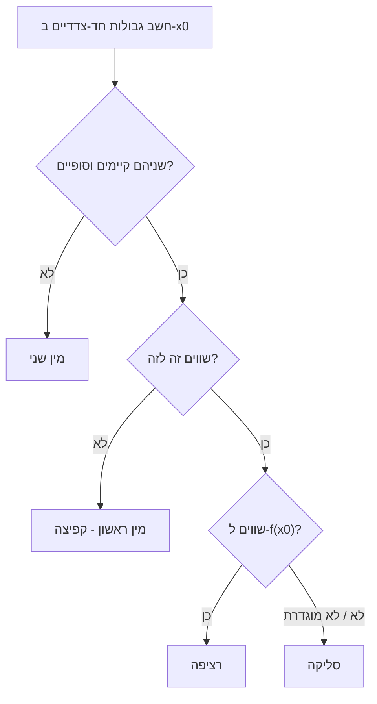

# מיון נקודות אי-רציפות

> מקור: כרך ב, סעיף 5.1.5 (הגדרות 5.21–5.23) + משפט 5.41

## שלושת הסוגים

### 1. אי-רציפות סליקה (הגדרה 5.21)

הגבול $\lim_{x\to x_0} f(x) = L$ **קיים וסופי**, אבל $f(x_0)$ לא מוגדר, או $f(x_0) \ne L$.

"תקלה נקודתית" — הגדרה מחדש של ערך אחד ($f(x_0):=L$) מתקנת את הרציפות; מכאן השם "סליקה" (ניתנת לסילוק). דוגמאות: $\frac{\sin x}{x}$ ב-$0$ (הגבול 1, לא מוגדרת); $\frac{x^2-1}{x-1}$ ב-$1$ (הגבול 2); $f(x)=x^2$ עם $f(0):=7$ (מוגדרת "לא נכון").

### 2. אי-רציפות ממין ראשון — "קפיצה" (הגדרה 5.22)

שני [[גבולות חד-צדדיים|הגבולות החד-צדדיים]] קיימים וסופיים אבל **שונים**:
$$\lim_{x\to x_0^-} f(x) = L_1 \neq L_2 = \lim_{x\to x_0^+} f(x)$$

**גובה הקפיצה**: $L_2-L_1$. דוגמאות: $\lfloor x\rfloor$ בכל שלם (קפיצה 1); $\operatorname{sgn}(x)$ ב-$0$ (קפיצה 2). שום תיקון נקודתי לא עוזר — אפשר "להדביק" את הערך לצד אחד לכל היותר, והגרף קופץ ממילא.

### 3. אי-רציפות ממין שני (הגדרה 5.23)

כל השאר: **לפחות אחד** הגבולות החד-צדדיים לא קיים או אינסופי. דוגמאות לפי תת-סוג:
- **התנדנדות**: $\sin\frac1x$ ב-$0$ — החד-צדדיים לא קיימים (תנודות אינסופיות).
- **בריחה לאינסוף**: $\frac1x$ ב-$0$ — חד-צדדיים אינסופיים ($\pm\infty$).
- **כאוס מלא**: [[פונקציית דיריכלה]] — אין שום גבול, בכל נקודה.
- **מעורב**: $e^{1/x}$ ב-$0$ — משמאל $0$ (קיים!), מימין $\infty$ — מספיק צד אחד רע.

## סדר עבודה למיון (אלגוריתם)

1. חשבו $\lim_{x\to x_0^-}f$ ו-$\lim_{x\to x_0^+}f$.
2. שניהם קיימים, סופיים **ושווים** → הגבול קיים: אם שווה גם ל-$f(x_0)$ — רציפה; אחרת (או לא מוגדרת) — **סליקה**.
3. קיימים, סופיים **ושונים** → **מין ראשון**.
4. אחרת → **מין שני**.

### דוגמה עבודה

$f(x)=\dfrac{|x^2-x|}{x^2-x}$ (מוגדרת כש-$x^2-x\ne0$, כלומר $x\ne0,1$). זו פונקציית סימן של $x(x-1)$: שווה $1$ כש-$x<0$ או $x>1$, ושווה $-1$ ב-$(0,1)$. ב-$x=0$: משמאל $1$, מימין $-1$ — מין ראשון. ב-$x=1$: משמאל $-1$, מימין $1$ — מין ראשון. (לא סליקה, אף שהפונקציה "רק לא מוגדרת" שם — ההגדרה דורשת גבול קיים!)

## משפטים מבניים — אילו אי-רציפויות "מותרות" למי

- **מונוטונית — רק קפיצות** (משפט 5.41): לפונקציה מונוטונית בקטע יש גבולות חד-צדדיים סופיים בכל נקודה פנימית (משפטים 5.39–5.40: הגבול משמאל הוא $\sup$ הערכים משמאל — קיים בזכות [[חסמים - חסם עליון ותחתון|תכונת החסם]]), ולכן כל אי-רציפות שלה — ממין ראשון. מסקנה נוספת: לפונקציה מונוטונית יש לכל היותר מספר בן-מנייה של אי-רציפויות (לכל קפיצה יש רציונלי משלה).
- **נגזרת — בלי קפיצות** (משפט 8.12, מ[[משפט דארבו]]): פונקציה שהיא נגזרת של פונקציה אחרת אינה יכולה לקפוץ — אי-הרציפויות שלה הן ממין שני בלבד. לכן $\lfloor x \rfloor$ ו-$\operatorname{sgn}(x)$ **אינן נגזרות** של אף פונקציה; ולעומתן הנגזרת של $x^2\sin\frac1x$ — לא רציפה ב-0 אבל ממין שני. השילוב של שני המשפטים: **נגזרת מונוטונית-למקוטעין עם אי-רציפות — בלתי אפשרי מהצד של דארבו אם זו קפיצה.**

## למה המיון הזה שימושי

- **אינטגרביליות (בקורסי המשך)**: מין ראשון וסליקות "לא מזיקות"; ריבוי מין-שני מסבך.
- **השלמה ברציפות**: רק סליקה ניתנת לתיקון — שאלת "האם ניתן להגדיר את $f$ ב-$x_0$ כך שתהיה רציפה?" היא בדיוק "האם האי-רציפות סליקה?".
- **זיהוי מהיר בחקירת פונקציה**: כל נקודה חשודה (איפוס מכנה, תפר הגדרה, ערך מוחלט מתאפס) מקבלת תווית לפי האלגוריתם.

## כרטיס דיוק

- **רעיון-על**: סוג אי-הרציפות נקבע על-ידי שני הגבולות החד-צדדיים בלבד — קיימים/סופיים/שווים הם שלושת המתגים.
- **מתי מפעילים**: פונקציות לפי מקרים, רציונליות עם חורים, ערך מוחלט, חלק שלם; ושאלות "האם ניתן להשלים ברציפות".
- **בדיקה עצמית**: (א) מיינו: $\sin\frac1x$, $\ \frac{|x|}{x}$, $\ \frac{x^2-1}{x-1}$, $\ \frac{1}{x^2}$, $\ e^{1/x}$ — כולן ב-0 או בנקודה הבעייתית. (ב) הוכיחו שמונוטונית לא יכולה לסבול מין שני. (ג) למה $\lfloor x\rfloor$ אינה נגזרת של אף פונקציה?
- **מלכודת**: סליקה דורשת **גבול קיים וסופי** — "הפונקציה לא מוגדרת שם" לבדו לא הופך אי-רציפות לסליקה.
- **קישור רוחב**: ראו גם [[מפת תלות משפטים - אינפי 1]], [[תבניות הוכחה באינפי 1]], [[אינדקס דוגמאות נגד - אינפי 1]].

## תרשים מיון

## קשרים

- [[גבולות חד-צדדיים]] — כלי המיון
- [[רציפות בנקודה]] — ההגדרה שנכשלת
- [[פונקציות מונוטוניות ופונקציה הפוכה רציפה]] — מונוטונית: רק קפיצות
- [[משפט דארבו]] — למה נגזרות לא קופצות
- [[פונקציית דיריכלה]] — מין שני בכל נקודה
- [[תכונת ארכימדס והחלק השלם]] — $\lfloor x\rfloor$ כדוגמת קפיצה
