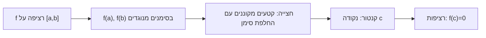

# משפט ערך הביניים

> מקור: כרך ב, סעיפים 5.2.2–5.2.3 (משפטים 5.29–5.34)

## גרסת השורש (משפט 5.29)

אם $f$ רציפה ב-$[a,b]$ ו-$f(a)\cdot f(b) < 0$ (סימנים מנוגדים בקצוות), אז קיימת נקודה $c\in(a,b)$ עם:
$$f(c) = 0$$

### הוכחה מלאה — חצייה (משפט חובה למבחן)

נניח בה"כ $f(a)<0<f(b)$. נבנה קטעים מקוננים באינדוקציה: $[a_0,b_0]=[a,b]$. בהינתן $[a_n,b_n]$ עם $f(a_n)\le0\le f(b_n)$, נסמן $m=\frac{a_n+b_n}{2}$:
- אם $f(m)=0$ — סיימנו (מצאנו $c=m$).
- אם $f(m)>0$: ניקח $[a_{n+1},b_{n+1}]=[a_n,m]$ (הסימנים בקצוות עדיין $\le0\le$).
- אם $f(m)<0$: ניקח $[m,b_n]$.

**האינווריאנטה נשמרת**: $f(a_n)\le 0\le f(b_n)$ לכל $n$, והאורכים $\frac{b-a}{2^n}\to0$. לפי [[הלמה של קנטור]] קיימת נקודה יחידה $c$ עם $a_n\to c$ ו-$b_n\to c$. מ[[רציפות בנקודה|רציפות (היינה)]]:
$$f(c)=\lim f(a_n)\le 0 \quad\text{וגם}\quad f(c)=\lim f(b_n)\ge 0$$
(מעבר גבול שומר אי-שוויון חלש — [[כללי סדר ומשפט הסנדוויץ|משפט 2.31]]). לכן $f(c)=0$; ומכיוון ש-$f(a),f(b)\ne0$, בהכרח $c\in(a,b)$. ∎

**ההוכחה קונסטרוקטיבית** — זו בדיוק שיטת הביסקציה הנומרית: כל צעד מכפיל את הדיוק; אחרי $n$ צעדים השורש ידוע עד כדי $\frac{b-a}{2^n}$.

## הגרסה הכללית (משפט 5.31)

אם $f$ רציפה ב-$[a,b]$ ו-$t$ מספר בין $f(a)$ ל-$f(b)$, אז קיים $c\in[a,b]$ עם $f(c)=t$.
(הוכחה בשורה: מיישמים את 5.29 על $g(x)=f(x)-t$ — רציפה, ומחליפה סימן.)

**סיסמה**: פונקציה רציפה לא מדלגת על ערכים. לכן תמונת קטע היא קטע (משפט 5.34).

## מסקנות ושימושים

- **שורש לפולינום ממעלה אי-זוגית** (משפט 5.30): $p(x)=x^{2k+1}+\dots$ שואף ל-$-\infty$ ב-$-\infty$ ול-$+\infty$ ב-$+\infty$ (המונום המוביל שולט) ⟹ יש $a,b$ עם סימנים מנוגדים ⟹ שורש ממשי. (למעלה זוגית אין ערובה: $x^2+1$.)
- **נקודת שבת** (משפט 5.32): $f:[a,b]\to[a,b]$ רציפה ⟹ יש $x$ עם $f(x)=x$. הוכחה: $g(x)=f(x)-x$ מקיימת $g(a)=f(a)-a\ge0$ (כי $f(a)\in[a,b]$) ו-$g(b)\le0$; ערך ביניים. ∎ (גרסה חד-ממדית של משפטי נקודת שבת מפורסמים.)
- **קיום שורשים $\sqrt[n]{c}$ — שוב** (טענה 5.33): דרך רציפות $x^n$ על $[0,\max(1,c)]$ — בלי [[אקסיומת השלמות|העבודה הידנית של יחידה 1]]. השוואת שתי ההוכחות מדגימה כמה חזק הכלי שנבנה.
- **תבנית "הוכיחו שקיים פתרון"**: מציגים את המשוואה כ-$f(x)=0$ עם $f$ רציפה, מאתרים שתי נקודות עם סימנים מנוגדים (בהצבה!), מצטטים את המשפט. דוגמה: ל-$x=\cos x$ יש פתרון ב-$(0,\frac\pi2)$ — $g(x)=x-\cos x$, $g(0)=-1<0$, $g(\frac\pi2)=\frac\pi2>0$. ∎
- **משוואות "מוזרות"**: קיום $c$ שבו שתי פונקציות רציפות נפגשות ($f=g$) — עובדים עם ההפרש.

## התנאים הכרחיים

- **בלי רציפות**: $\operatorname{sgn}(x)$ על $[-1,1]$ — סימנים מנוגדים בקצוות, אין שורש (מדלגת מ-$-1$ ל-$1$ דרך $0$? הערך בנקודה הבודדת 0 הוא 0 — ניקח $\operatorname{sgn}$ בלי הנקודה, או $f(x)=-1$ ל-$x\le0$, $f(x)=1$ ל-$x>0$ — מדלגת על כל $(-1,1)$).
- **בתחום שאינו קטע**: $\frac1x$ על $[-1,0)\cup(0,1]$ — רציפה שם, סימנים מנוגדים, אין שורש. הקטעיות (קשירות) של התחום מהותית.

## הכיוון ההפוך?

תכונת ערך הביניים **לא** גוררת רציפות: $f(x)=\sin\frac1x$ ($x\ne0$), $f(0)=0$ — מקבלת כל ערך ביניים על כל קטע סביב 0 (התנודות מכסות את $[-1,1]$) בלי להיות רציפה ב-0. מפתיע יותר: **כל נגזרת** מקיימת את תכונת ערך הביניים גם כשאינה רציפה — [[משפט דארבו]]. כלומר התכונה מאפיינת מחלקה רחבה מהרציפות.

## כרטיס דיוק

- **רעיון-על**: פונקציה רציפה על קטע לא מדלגת על ערכים — הגרף חייב לחצות כל גובה ביניים.
- **מתי מפעילים**: קיום שורש/פתרון/נקודת שבת; הוכחה שתמונה מכילה קטע; ותבנית "העבר אגף והגדר $g$".
- **בדיקה עצמית**: (א) הוכיחו של-$x^3+x-1=0$ פתרון ב-$(0,1)$. (ב) שחזרו את הוכחת החצייה עם האינווריאנטה. (ג) הוכיחו את משפט נקודת השבת.
- **מלכודת**: המשפט מוכיח **קיום**, לא יחידות — ליחידות מוסיפים מונוטוניות ממש; והתחום חייב להיות קטע אחד רציף.
- **קישור רוחב**: ראו גם [[מפת תלות משפטים - אינפי 1]], [[תבניות הוכחה באינפי 1]], [[אינדקס דוגמאות נגד - אינפי 1]].

## תרשים קיום שורש

## קשרים

- [[הלמה של קנטור]] — מנוע ההוכחה
- [[רציפות בקטע]] — ההקשר: למה קטע סגור
- [[כללי סדר ומשפט הסנדוויץ]] — מעבר הגבול בסוף ההוכחה
- [[משפטי ויירשטראס]] — המשפט האח; יחד: תמונת קטע סגור
- [[פונקציות אלמנטריות]] — שורש לפולינום אי-זוגי
- [[משפט דארבו]] — ערך ביניים לנגזרות
