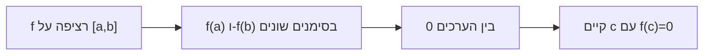

# משפט ערך הביניים

> מקור: כרך ב, סעיפים 5.2.2–5.2.3 (משפטים 5.29–5.34)

## גרסת השורש (משפט 5.29)

אם $f$ רציפה ב-$[a,b]$ ו-$f(a)\cdot f(b) < 0$ (סימנים מנוגדים בקצוות), אז קיימת נקודה $c\in(a,b)$ עם:
$$f(c) = 0$$

### רעיון ההוכחה — חצייה
חוצים את $[a,b]$; אם הערך באמצע אינו 0, באחד החצאים הסימנים בקצוות עדיין מנוגדים — בוחרים אותו וחוזרים. מתקבלת סדרת קטעים מקוננים מתכווצים; [[הלמה של קנטור]] נותנת נקודה $c$, ו[[רציפות בנקודה|רציפות (היינה)]] כופה $f(c)=0$: הגבול של ערכים $\le 0$ ושל ערכים $\ge 0$ בו-זמנית. ∎
(ההוכחה קונסטרוקטיבית — זו שיטת הביסקציה הנומרית לאיתור שורשים.)

## הגרסה הכללית — קושי (משפט 5.31)

אם $f$ רציפה ב-$[a,b]$ ו-$t$ מספר בין $f(a)$ ל-$f(b)$, אז קיים $c\in[a,b]$ עם $f(c)=t$.
(מיישמים את 5.29 על $g(x)=f(x)-t$.)

**פונקציה רציפה לא מדלגת על ערכים.** לכן תמונת קטע היא קטע (משפט 5.34).

## מסקנות ושימושים

- **שורש לפולינום ממעלה אי-זוגית** (משפט 5.30): באינסוף המרוחק הסימנים מנוגדים ⟹ יש שורש ממשי.
- **נקודת שבת** (משפט 5.32): $f:[a,b]\to[a,b]$ רציפה ⟹ יש $x$ עם $f(x)=x$ (מפעילים ערך ביניים על $g(x)=f(x)-x$: $g(a)\ge0\ge g(b)$).
- **קיום שורשים ($\sqrt[n]{c}$) — שוב** (טענה 5.33): הפעם דרך רציפות $x^n$, בלי [[אקסיומת השלמות|העבודה הישירה של יחידה 1]].
- הוכחות קיום פתרון למשוואות: מציגים כ-$f(x)=0$, מאתרים שני קצוות עם סימנים מנוגדים.

## התנאים הכרחיים

- בלי רציפות: $\operatorname{sgn}(x)$ מדלגת על כל $(0,1)$.
- בקטע לא רציף (איחוד קטעים): $\frac1x$ על $[-1,0)\cup(0,1]$ — סימנים מנוגדים, אין שורש.

## הכיוון ההפוך?

תכונת ערך הביניים **לא** גוררת רציפות: $\sin\frac1x$ (עם ערך כלשהו ב-0) מקבלת כל ערך ביניים בלי להיות רציפה. מפתיע יותר: כל **נגזרת** מקיימת את תכונת ערך הביניים גם בלי רציפות — [[משפט דארבו]].

<!-- codex-enhanced: 2026-07-10 -->

## כרטיס דיוק

- **רעיון-על**: פונקציה רציפה על קטע לא יכולה לדלג מעל ערכים בין שני ערכיה.
- **מתי מפעילים**: להוכחת קיום שורש, קיום פתרון למשוואה, או שהטווח מכיל קטע.
- **בדיקה עצמית**: הראו שלמשוואה $x^3+x-1=0$ יש פתרון ב-$(0,1)$.
- **מלכודת**: המשפט מוכיח קיום, לא יחידות; ליחידות צריך מונוטוניות או טיעון נוסף.
- **קישור רוחב**: ראו גם [[מפת תלות משפטים - אינפי 1]], [[תבניות הוכחה באינפי 1]], [[אינדקס דוגמאות נגד - אינפי 1]].

## תרשים קיום שורש

## קשרים

- [[הלמה של קנטור]] — מנוע ההוכחה
- [[רציפות בקטע]] — ההקשר
- [[משפטי ויירשטראס]] — המשפט האח
- [[משפט דארבו]] — ערך ביניים לנגזרות
