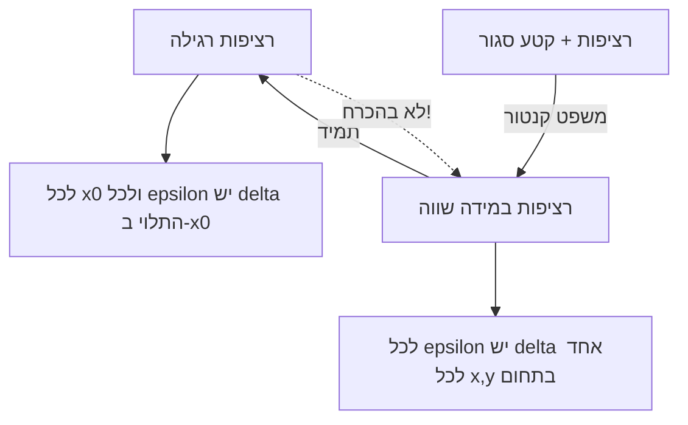

# רציפות במידה שווה ומשפט קנטור

> מקור: כרך ב, פרק 5.3 (הגדרה 5.46, טענה 5.47, משפטים 5.48–5.49)

## ההגדרה (5.46)

$f$ **רציפה במידה שווה (במ"ש)** בקטע $I$ אם:
$$\forall\varepsilon>0\ \exists\delta>0:\ \forall x_1,x_2\in I,\quad |x_1-x_2|<\delta \implies |f(x_1)-f(x_2)|<\varepsilon$$

## ההבדל מרציפות רגילה — מיקום הכמתים

- **רציפות ב-$I$**: $\forall x_0\,\forall\varepsilon\,\exists\delta$ — ה-$\delta$ רשאי להיות תלוי ב-$x_0$ ("דלתא מקומי", נתפר לכל נקודה).
- **במ"ש**: $\forall\varepsilon\,\exists\delta\,\forall x_1,x_2$ — $\delta$ **אחד שעובד לכל זוג נקודות בקטע** ("דלתא אוניברסלי").

זו בדיוק החלפת סדר כמתים ($\forall x\,\exists\delta$ ⟵ $\exists\delta\,\forall x$) — הדוגמה החשובה בקורס לכך ש[[קבוצות, יחסים ופעולות|סדר כמתים משנה משמעות]]. **במ"ש ⟹ רציפות** (טענה 5.47 — הדלתא האוניברסלי עובד בפרט בכל נקודה); ההפך לא נכון:

- $f(x)=x^2$ על $\mathbb{R}$: רציפה אך **לא במ"ש** — ככל שמתרחקים, השיפוע גדל: $|x_1^2-x_2^2|=|x_1+x_2||x_1-x_2|$, והגורם $|x_1+x_2|$ אינו חסום, אז שום $\delta$ קבוע לא שורד רחוק. (על קטע חסום $[0,10]$ — כן במ"ש: $|x_1+x_2|\le20$ ⟹ $\delta=\frac{\varepsilon}{20}$.)
- $f(x)=\frac1x$ על $(0,1)$: רציפה אך לא במ"ש — ליד $0$ הפונקציה "מתפוצצת": נקודות קרובות כרצוננו עם ערכים רחוקים.

**דוגמה חיובית ישירה**: $f(x)=\sqrt x$ במ"ש על $[0,\infty)$ — מ-$|\sqrt{x_1}-\sqrt{x_2}|\le\sqrt{|x_1-x_2|}$ אפשר לקחת $\delta=\varepsilon^2$. וכל פונקציה **ליפשיצית** ($|f(x_1)-f(x_2)|\le K|x_1-x_2|$, למשל בעלת נגזרת חסומה) במ"ש עם $\delta=\frac\varepsilon K$.

### קריטריון השלילה (דרך סדרות) — הכלי המעשי

$f$ **אינה** במ"ש ב-$I$ $\iff$ קיימות סדרות $x_n, y_n \in I$ עם $|x_n - y_n| \to 0$ אבל $|f(x_n)-f(y_n)| \not\to 0$.

- ל-$x^2$ על $\mathbb{R}$: $x_n = n+\frac1n,\ y_n = n$: הפרש $\frac1n\to0$, אבל $|f(x_n)-f(y_n)|=2+\frac1{n^2}\to2\ne0$. ✗
- ל-$\frac1x$ על $(0,1)$: $x_n=\frac1n,\ y_n=\frac1{2n}$: הפרש $\to0$, ערכים נבדלים ב-$n\to\infty$. ✗

## משפט קנטור (5.48)

**פונקציה רציפה בקטע סגור — רציפה בו במידה שווה.**

### הוכחה מלאה (בשלילה + בולצאנו-ויירשטראס)

נניח ש-$f$ רציפה ב-$[a,b]$ אך לא במ"ש. אז יש $\varepsilon_0>0$ כך שלכל $\delta=\frac1n$ קיימות נקודות $x_n,y_n\in[a,b]$ עם
$$|x_n-y_n|<\frac1n \quad\text{אבל}\quad |f(x_n)-f(y_n)|\ge\varepsilon_0.$$
הסדרה $\{x_n\}$ חסומה ⟹ [[משפט בולצאנו-ויירשטראס]] נותן תת-סדרה $x_{n_k}\to c$, ומ**סגירות** $c\in[a,b]$. מכיוון ש-$|x_{n_k}-y_{n_k}|<\frac{1}{n_k}\to0$, גם $y_{n_k}\to c$ (סנדוויץ' על $|y_{n_k}-c|\le|y_{n_k}-x_{n_k}|+|x_{n_k}-c|$). מ[[רציפות בנקודה|רציפות ב-$c$ (היינה)]]:
$$f(x_{n_k})\to f(c), \qquad f(y_{n_k})\to f(c),$$
ולכן $|f(x_{n_k})-f(y_{n_k})|\to0$ — סתירה ל-$\ge\varepsilon_0$. ∎

(אותו שלד משולש כמו ב[[משפטי ויירשטראס]]: סדרה מהשלילה ⟵ ב"ו ⟵ סגירות+רציפות. דרך חלופית: [[הלמה של היינה-בורל]].)

## אפיון בקטע פתוח (משפט 5.49)

$f$ רציפה ב-$(a,b)$ (חסום) היא במ"ש שם $\iff$ הגבולות החד-צדדיים $\lim_{x\to a^+}f$, $\lim_{x\to b^-}f$ **קיימים וסופיים**.

אינטואיציה: אם הגבולות קיימים, "משלימים" את $f$ לפונקציה רציפה על $[a,b]$ ומפעילים קנטור; אם לא — הכישלון בקצה מפר במ"ש. שימושים מיידיים:
- $\sin\frac1x$ על $(0,1)$: **לא** במ"ש (אין גבול ב-$0^+$).
- $x\sin\frac1x$ על $(0,1)$: **כן** במ"ש (הגבול ב-$0^+$ הוא 0, ב-$1^-$ קיים).
- $\frac1x$ על $(0,1)$: לא במ"ש (גבול אינסופי ב-$0^+$).

זהו כלי ההכרעה המהיר ביותר לשאלות במ"ש על קטע פתוח חסום. (על קרן אינסופית הוא לא חל — שם בודקים ידנית או דרך ליפשיץ/נגזרת חסומה.)

## למה המושג חשוב

במ"ש היא סוג האחידות שנחוץ למשפטים **גלובליים** — בקורסי המשך היא המפתח לאינטגרביליות של פונקציה רציפה (חלוקת הקטע לרצועות בעובי $\delta$ אחיד). בקורס הזה: הדוגמה המובהקת לכוחו של קטע סגור, והזירה שבה לומדים לקרוא כמתים ברצינות.

## כרטיס דיוק

- **רעיון-על**: במ"ש מחליפה $\delta$ נקודתי ב-$\delta$ אחד לכל התחום; קנטור אומר שעל קטע סגור ההבחנה נעלמת.
- **מתי מפעילים**: שאלות "האם במ"ש?" — קטע סגור: כן אוטומטית (קנטור); פתוח חסום: בדיקת גבולות בקצוות (5.49); תחום אינסופי: ליפשיץ/נגזרת חסומה או קריטריון השלילה.
- **בדיקה עצמית**: (א) הוכיחו ש-$x^2$ לא במ"ש על $\mathbb{R}$ ו-כן על $[0,10]$. (ב) שחזרו את הוכחת קנטור. (ג) הכריעו: $\sqrt x$ על $[0,\infty)$? $\ \tan x$ על $(-\frac\pi2,\frac\pi2)$?
- **מלכודת**: רציפות בכל נקודה אינה מבטיחה במ"ש על תחום לא קומפקטי; וסדר הכמתים הוא כל ההבדל.
- **קישור רוחב**: ראו גם [[מפת תלות משפטים - אינפי 1]], [[תבניות הוכחה באינפי 1]], [[אינדקס דוגמאות נגד - אינפי 1]].

## תרשים כמתים

## קשרים

- [[רציפות בקטע]] — ההשוואה המרכזית; אותם כמתים בסדר אחר
- [[קבוצות, יחסים ופעולות]] — קריאת כמתים
- [[משפט בולצאנו-ויירשטראס]] — מנוע ההוכחה
- [[משפטי ויירשטראס]], [[משפט ערך הביניים]] — שאר משפטי הקטע הסגור
- [[גבולות חד-צדדיים]] — האפיון בקטע פתוח
- [[הלמה של היינה-בורל]] — דרך חלופית להוכיח את קנטור (צנזור)
