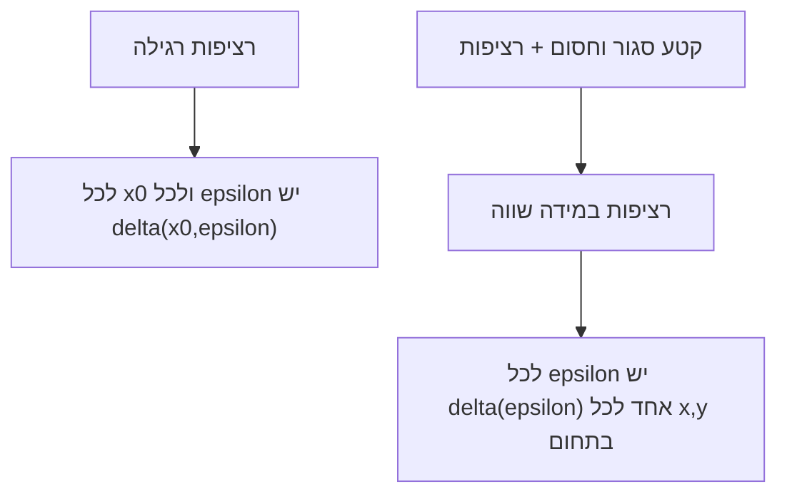

# רציפות במידה שווה ומשפט קנטור

> מקור: כרך ב, פרק 5.3 (הגדרה 5.46, טענה 5.47, משפטים 5.48–5.49)

## ההגדרה (5.46)

$f$ **רציפה במידה שווה (במ"ש)** בקטע $I$ אם:
$$\forall\varepsilon>0\ \exists\delta>0:\ \forall x_1,x_2\in I,\quad |x_1-x_2|<\delta \implies |f(x_1)-f(x_2)|<\varepsilon$$

## ההבדל מרציפות רגילה — מיקום הכמתים

- **רציפות ב-$I$**: לכל $x_0$ ולכל $\varepsilon$ יש $\delta$ — ה-$\delta$ רשאי להיות תלוי ב-$x_0$ ("דלתא מקומי").
- **במ"ש**: לכל $\varepsilon$ יש $\delta$ **אחד שעובד לכל זוג נקודות בקטע** ("דלתא אוניברסלי").

במ"ש ⟹ רציפות (טענה 5.47); ההפך לא נכון:
- $f(x)=x^2$ על $\mathbb{R}$: רציפה אך לא במ"ש — ככל שמתרחקים, השיפוע גדל וה-$\delta$ הנדרש מתכווץ לאפס.
- $f(x)=\frac1x$ על $(0,1)$: רציפה אך לא במ"ש — ליד $0$ הפונקציה "מתפוצצת".

קריטריון שלילה שימושי (דרך סדרות): אם יש $x_n, y_n \in I$ עם $|x_n - y_n| \to 0$ אבל $|f(x_n)-f(y_n)| \not\to 0$ — לא במ"ש. (ל-$x^2$: $x_n = n+\frac1n,\ y_n = n$.)

## משפט קנטור (5.48)

**פונקציה רציפה בקטע סגור — רציפה בו במידה שווה.**

*רעיון ההוכחה (בשלילה + בולצאנו-ויירשטראס)*: אם לא במ"ש, יש $\varepsilon_0$ וזוגות $x_n,y_n$ עם $|x_n-y_n|<\frac1n$ אבל $|f(x_n)-f(y_n)|\ge\varepsilon_0$. [[משפט בולצאנו-ויירשטראס]] נותן $x_{n_k}\to c\in[a,b]$ (הסגירות!), וגם $y_{n_k}\to c$. רציפות ב-$c$ כופה ששני הערכים יתקרבו ל-$f(c)$ — סתירה ל-$\ge\varepsilon_0$. ∎

## אפיון בקטע פתוח (משפט 5.49)

$f$ רציפה ב-$(a,b)$ היא במ"ש שם $\iff$ הגבולות החד-צדדיים $\lim_{x\to a^+}f$, $\lim_{x\to b^-}f$ קיימים וסופיים.
(אינטואיציה: אפשר "להשלים" את $f$ לפונקציה רציפה על $[a,b]$ ולהפעיל קנטור.)
כך רואים מיד: $\sin\frac1x$ על $(0,1)$ לא במ"ש (אין גבול ב-$0^+$), אבל $x\sin\frac1x$ כן.

## למה המושג חשוב

במ"ש היא סוג האחידות שנחוץ למשפטים גלובליים — בקורסי המשך היא המפתח לאינטגרביליות של פונקציה רציפה. בקורס הזה: דוגמה מובהקת לכוח של קטע סגור + [[משפט בולצאנו-ויירשטראס]].

<!-- codex-enhanced: 2026-07-10 -->

## כרטיס דיוק

- **רעיון-על**: במ"ש מחליפה $\delta$ נקודתית ב-$\delta$ אחד לכל התחום.
- **מתי מפעילים**: כשצריך לשלוט בפונקציה על קטע שלם, בהמשכיות לקומפקטיות, או בהשוואת נקודות רחוקות מהמרכז.
- **בדיקה עצמית**: הוכיחו ש-$x^2$ אינה במ"ש על $\mathbb R$ בעזרת זוגות נקודות קרובות עם ערכים רחוקים.
- **מלכודת**: רציפות בכל נקודה אינה מבטיחה במ"ש על תחום לא קומפקטי.
- **קישור רוחב**: ראו גם [[מפת תלות משפטים - אינפי 1]], [[תבניות הוכחה באינפי 1]], [[אינדקס דוגמאות נגד - אינפי 1]].

## תרשים כמתים

## קשרים

- [[רציפות בקטע]] — ההשוואה המרכזית
- [[משפט בולצאנו-ויירשטראס]] — מנוע ההוכחה
- [[משפטי ויירשטראס]], [[משפט ערך הביניים]] — שאר משפטי הקטע הסגור
- [[הלמה של היינה-בורל]] — דרך חלופית להוכיח את קנטור (צנזור)
