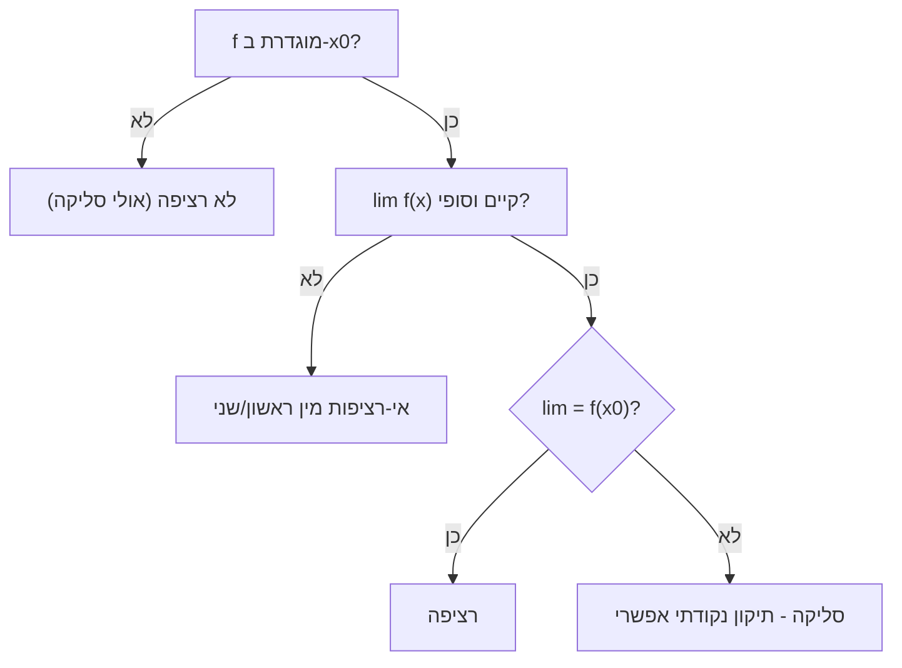

# רציפות בנקודה

> מקור: כרך ב, פרק 5.1 (הגדרות 5.1–5.2, 5.16; טענות 5.3–5.7, 5.17–5.20; משפטים 5.11, 5.14–5.15)

## ההגדרה (5.1–5.2)

$f$ **רציפה ב-$x_0$** אם:
$$\lim_{x\to x_0} f(x) = f(x_0)$$

שלושה תנאים בחבילה אחת (הגדרה 5.2), וכל אחד יכול להיכשל בנפרד:
1. $f$ **מוגדרת** ב-$x_0$ — נכשל: $\frac{\sin x}{x}$ ב-0.
2. **הגבול קיים** (וסופי) — נכשל: $\operatorname{sgn}(x)$ ב-0 (חד-צדדיים שונים), $\sin\frac1x$ ב-0 (אין בכלל).
3. **הגבול שווה לערך** — נכשל: $f(x)=\begin{cases}x^2 & x\ne0\\ 5 & x=0\end{cases}$ — הגבול 0, הערך 5.

ההבדל מ[[גבול של פונקציה בנקודה|גבול]]: הגבול מתעלם בכוונה מ-$f(x_0)$; הרציפות דורשת שהערך "יתאים לסביבה". אינטואיציה: אין קפיצה, אין חור — אפשר לצייר בלי להרים עיפרון (ליד הנקודה). אבל זהירות: האינטואיציה הגרפית נשברת בדוגמאות כמו [[פונקציית דיריכלה]] — רק ההגדרה שורדת תמיד.

### ניסוחים שקולים

- **$\varepsilon$–$\delta$** (טענה 5.3): $\forall\varepsilon>0\ \exists\delta>0:\ |x-x_0|<\delta \Rightarrow |f(x)-f(x_0)|<\varepsilon$. שימו לב — **בלי נקיבה**! ב-$x=x_0$ התנאי מתקיים ממילא ($|f(x_0)-f(x_0)|=0$), אז אין צורך להחריג.
- **היינה** (טענה 5.4): לכל סדרה $x_n \to x_0$ (מותר $x_n = x_0$!): $f(x_n) \to f(x_0)$. הניסוח החשוב ביותר למעשה: **רציפות = מותר להחליף גבול ופונקציה**:
$$\lim_{n\to\infty} f(x_n) = f\left(\lim_{n\to\infty} x_n\right)$$
זה מה שמכשיר את "הצבת הגבול" בסדרות רקורסיביות ([[סדרות מונוטוניות]]) ואת משוואות הגבול בכלל.
- **רציפות חד-צדדית** (הגדרה 5.16, טענה 5.18): רציפה מימין אם $\lim_{x\to x_0^+}f(x)=f(x_0)$; רציפה $\iff$ רציפה מימין וגם משמאל. דוגמה: $\lfloor x\rfloor$ רציפה **מימין** בכל שלם (הגבול מימין שווה לערך) אך לא משמאל.

## אילו פונקציות רציפות?

- **אריתמטיקה** (משפט 5.11): $f,g$ רציפות ב-$x_0$ ⟹ גם $f\pm g$, $fg$, ו-$\frac fg$ (אם $g(x_0)\ne0$) רציפות שם. (נובע ישירות מ[[אריתמטיקה וכללים לגבולות פונקציות|אריתמטיקת הגבולות]].)
- **הרכבה** (משפט 5.15): $g$ רציפה ב-$t_0$ ו-$f$ רציפה ב-$g(t_0)$ ⟹ $f\circ g$ רציפה ב-$t_0$.
- **הכנסת גבול פנימה** (משפט 5.14): אם $\lim_{t\to t_0}g(t)=x_0$ ו-$f$ רציפה ב-$x_0$, אז
  $$\lim_{t\to t_0} f(g(t)) = f\left(\lim_{t\to t_0} g(t)\right) = f(x_0)$$
  — **בלי** התנאי העדין של משפט 4.39 (הרציפות של $f$ ב-$x_0$ בדיוק סותמת את החור שהתנאי נועד לעקוף). זו העבודה השחורה של כל חישובי הגבולות בהמשך: $\lim\sqrt{g(t)}=\sqrt{\lim g(t)}$, $\lim\sin(g(t))=\sin(\lim g(t))$ וכו'.

### מלאי הרציפות של הקורס

| משפחה | מקור |
|---|---|
| פולינומים ורציונליות (בתחומן) | מסקנה 5.12 |
| $\sin,\cos$ (בכל $\mathbb{R}$); $\tan$ בתחומה | טענה 5.7, משפט 5.13 |
| $\sqrt x$ ב-$[0,\infty)$ (ב-0 מימין) | טענות 5.5, 5.17 |
| $\|x\|$ | ישירות מ-$\big\|\|x\|-\|x_0\|\big\|\le\|x-x_0\|$ |
| $a^x,\ \log_a x$ בתחומן | [[פונקציות מעריכיות ולוגריתמיות|משפטים 6.9–6.14]] |

**אסטרטגיית העבודה**: פונקציה שבנויה מאלמנטריות בפעולות מותרות — רציפה בכל תחומה אוטומטית; ציטוט המשפטים מספיק. בדיקה ידנית (מהגדרה/חד-צדדית) נדרשת רק ב**נקודות תפר** של הגדרה-למקרים וב**נקודות מיוחדות** (קצה תחום, ערך מוגדר בנפרד).

### דוגמה עבודה — נקודת תפר

$f(x)=\begin{cases}\frac{\sin x}{x} & x\ne0\\ 1 & x=0\end{cases}$: בכל $x\ne0$ — מנת רציפות עם מכנה שונה מאפס ⟹ רציפה. ב-0: $\lim_{x\to0}\frac{\sin x}{x}=1=f(0)$ ([[הגבול של sin x חלקי x]]) ⟹ רציפה גם שם. זו "השלמה ברציפות" של אי-רציפות סליקה — ראו [[מיון נקודות אי-רציפות]].

## שתי תוצאות קטנות שחוזרות בהוכחות

- **שימור סימן**: $f$ רציפה ב-$x_0$ ו-$f(x_0)>0$ ⟹ קיימת סביבה שבה $f>0$ (קחו $\varepsilon=\frac{f(x_0)}2$). משמשת בהוכחת [[משפט ערך הביניים|ערך הביניים]] ובהמשך ב[[נקודות קיצון ומשפט פרמה|פרמה]].
- **חסימות מקומית**: רציפה ב-$x_0$ ⟹ חסומה בסביבה של $x_0$.

## כרטיס דיוק

- **רעיון-על**: רציפות = הגבול שווה לערך; ובניסוח היינה — מותר להחליף סדר בין גבול לפונקציה.
- **מתי מפעילים**: הרכבות והצבות גבול; בדיקת תפרים; והכשרת משוואות גבול בסדרות רקורסיביות.
- **בדיקה עצמית**: (א) אילו משלושת התנאים נכשל בכל אחת: $\frac{x^2-1}{x-1}$ ב-1, $\operatorname{sgn}$ ב-0, דיריכלה בכל נקודה? (ב) הוכיחו מהיינה שרציפות מאפשרת $\lim f(x_n)=f(\lim x_n)$. (ג) מדוע ב-$\varepsilon$–$\delta$ של רציפות אין נקיבה?
- **מלכודת**: פונקציה יכולה להיות מוגדרת בנקודה ולא רציפה שם; והגדרת ערך "לא מתאים" הורסת רציפות גם כשהגבול קיים.
- **קישור רוחב**: ראו גם [[מפת תלות משפטים - אינפי 1]], [[תבניות הוכחה באינפי 1]], [[אינדקס דוגמאות נגד - אינפי 1]].

## תרשים רציפות

## קשרים

- [[גבול של פונקציה בנקודה]] — המושג שעליו רציפות בנויה
- [[מיון נקודות אי-רציפות]] — מה קורה כשזה נכשל
- [[פונקציית דיריכלה]] — הקיצון: רציפה בשום מקום
- [[רציפות בקטע]] — מרציפות נקודתית לגלובלית
- [[אריתמטיקה וכללים לגבולות פונקציות]] — המשפטים שמאחורי הכללים
- [[הגדרת הנגזרת]] — גזירות ⟹ רציפות (משפט 7.9), לא להפך
