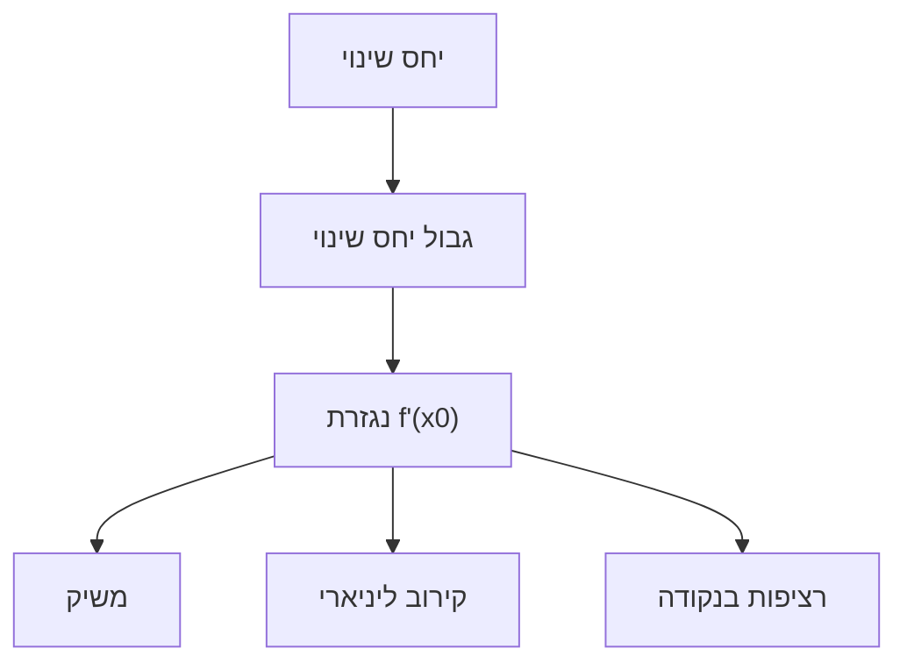

# הגדרת הנגזרת

> מקור: כרך ג, פרקים 7.1–7.2 (הגדרות 7.1–7.7, טענות 7.8, 7.10, משפט 7.9)

## שתי הבעיות שהולידו את הנגזרת (פרק 7.1)

1. **מהירות רגעית** (הגדרות 7.1–7.5): גוף במקום $f(t)$; המהירות הממוצעת בקטע זמן היא $\frac{f(t_2)-f(t_1)}{t_2-t_1}$; המהירות **הרגעית** — הגבול כשהקטע מתכווץ.
2. **משיק לעקומה** (הגדרה 7.6): שיפוע המיתר בין $(x,f(x))$ ל-$(x+h, f(x+h))$ הוא $\frac{f(x+h)-f(x)}{h}$; המשיק — הישר ששיפועו גבול שיפועי המיתרים.

שתי הבעיות — אותו גבול.

## ההגדרה (7.7)

$f$ מוגדרת בסביבת $x_0$. אם הגבול (הסופי!) קיים:
$$f'(x_0) = \lim_{h\to0}\frac{f(x_0+h)-f(x_0)}{h}$$
אומרים ש-$f$ **גזירה** ב-$x_0$, והגבול נקרא **הנגזרת**.

צורה שקולה (טענה 7.8):
$$f'(x_0) = \lim_{x\to x_0}\frac{f(x)-f(x_0)}{x-x_0}$$

## גזירות ⟹ רציפות (משפט 7.9)

אם $f$ גזירה ב-$x_0$, היא רציפה שם.
*רעיון*: $f(x)-f(x_0) = \frac{f(x)-f(x_0)}{x-x_0}\cdot(x-x_0) \to f'(x_0)\cdot 0 = 0$. ∎

**ההפך לא נכון** (טענה 7.10): $f(x)=|x|$ רציפה ב-$0$ ואינה גזירה שם — [[נגזרות חד-צדדיות|הנגזרות החד-צדדיות]] הן $\pm1$ ושונות (גרף עם "פינה"). דוגמאות אי-גזירות נוספות (סעיף 7.2.4): משיק אנכי ($\sqrt[3]{x}$ ב-0), התנדנדות ($x\sin\frac1x$ ב-0).

## שלוש דרכים לקרוא את $f'(x_0)$

1. **גאומטרית**: שיפוע המשיק לגרף ב-$(x_0, f(x_0))$ — [[קירוב ליניארי והדיפרנציאל|משוואת המשיק]].
2. **פיזיקלית**: קצב שינוי רגעי (מהירות, צפיפות קווית — סעיף 7.1.3).
3. **קירובית**: המספר שעבורו $f(x_0+h) \approx f(x_0) + f'(x_0)h$ עם שגיאה זניחה — הניסוח המדויק ב[[קירוב ליניארי והדיפרנציאל|משפט 7.35]], והוא הגשר ל[[משפט טיילור]].

## נגזרת כפונקציה, נגזרות גבוהות

$f'$ היא פונקציה בפני עצמה (בכל נקודה שבה הגבול קיים); $f''=(f')'$ (הגדרה 8.22 — גזירה פעמיים), וכן הלאה $f^{(n)}$.

<!-- codex-enhanced: 2026-07-10 -->

## כרטיס דיוק

- **רעיון-על**: נגזרת היא גבול של יחס שינוי; קיומה אומר שקיים קירוב ליניארי מקומי יחיד.
- **מתי מפעילים**: כשצריך לבדוק גזירות בנקודה, למצוא משיק, או להוכיח אי-גזירות.
- **בדיקה עצמית**: בדקו מההגדרה את גזירות $|x|$ ב-$0$ ואת גזירות $x^2$ בכל נקודה.
- **מלכודת**: גזירות גוררת רציפות, אבל רציפות אינה גוררת גזירות.
- **קישור רוחב**: ראו גם [[מפת תלות משפטים - אינפי 1]], [[תבניות הוכחה באינפי 1]], [[אינדקס דוגמאות נגד - אינפי 1]].

## תרשים הנגזרת

## קשרים

- [[גבול של פונקציה בנקודה]] — הנגזרת היא גבול
- [[כללי הגזירה]], [[כלל השרשרת]], [[נגזרות הפונקציות האלמנטריות]] — מכונת החישוב
- [[נקודות קיצון ומשפט פרמה]] — תחילת התורה ביחידה 8
