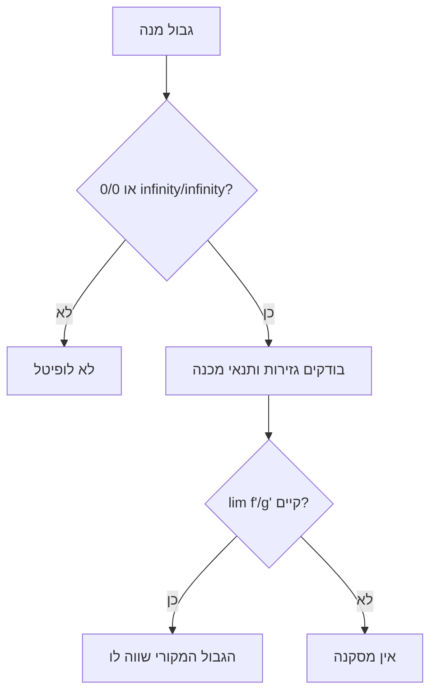

# כלל לופיטל

> מקור: כרך ג, פרק 8.3 (משפטים 8.13–8.16); סיכום צנזור הרצאות 46–47

## הכלל — צורת "$\frac00$" בנקודה (משפט 8.13)

$f,g$ גזירות בסביבה מנוקבת של $x_0$, ושתיהן שואפות שם ל-$0$:
$$\lim_{x\to x_0} f(x) = \lim_{x\to x_0} g(x) = 0$$
אם הגבול $\lim_{x\to x_0}\dfrac{f'(x)}{g'(x)}$ **קיים** (או אינסופי), אז:
$$\lim_{x\to x_0}\frac{f(x)}{g(x)} = \lim_{x\to x_0}\frac{f'(x)}{g'(x)}$$

*רעיון ההוכחה*: [[משפט קושי]] — $\frac{f(x)}{g(x)} = \frac{f'(c_x)}{g'(c_x)}$ עבור $c_x$ בין $x_0$ ל-$x$, ו-$c_x\to x_0$.

## הגרסאות (משפטים 8.14–8.16)

הכלל תקף באותה צורה עבור:
- גבולות חד-צדדיים ($x\to x_0^\pm$) — 8.14
- גבולות באינסוף ($x\to\pm\infty$) — 8.15
- צורת "$\frac{\infty}{\infty}$" — 8.16 (בכל סוגי הגבולות)

## חמש אזהרות קריטיות

1. **בדקו שזו באמת צורה בלתי-מוגדרת** — לופיטל על $\lim_{x\to0}\frac{\sin x}{x^3+1}$ (שאינו $\frac00$) נותן שטויות.
2. **אם $\lim\frac{f'}{g'}$ לא קיים — אין מסקנה!** הכלל חד-כיווני. דוגמה (צנזור): $\lim_{x\to0}\frac{x^2\sin\frac1x}{\sin x}$ — מנת הנגזרות מתנדנדת בלי גבול, אבל הגבול המקורי קיים ($=0$, דרך [[סדרות חסומות וסדרות אפסות|חסומה×אפסה]]).
3. **גוזרים מונה ומכנה בנפרד** — לא כמנה ([[כללי הגזירה|כלל המנה]])!
4. **מעגליות**: אסור להוכיח את [[הגבול של sin x חלקי x]] בלופיטל — נגזרת סינוס נשענת על הגבול הזה.
5. אפשר להפעיל שוב ושוב — אבל כל פעם לוודא מחדש שהצורה בלתי-מוגדרת; ולפעמים לופיטל "מסתובב במעגל" ($\frac{x}{\sqrt{x^2+1}}$ באינסוף — עדיף אלגברה).

## המרת צורות אחרות

| צורה | המרה |
|---|---|
| $0\cdot\infty$ | $fg = \dfrac{f}{1/g}$ → לרוב $\frac00$ או $\frac\infty\infty$ |
| $\infty - \infty$ | מכנה משותף / כפל בצמוד / הוצאת גורם |
| $1^\infty,\ 0^0,\ \infty^0$ | $f^g = e^{g\ln f}$ ([[פונקציות מעריכיות ולוגריתמיות]]) ולופיטל על המעריך |

דוגמאות מהצנזור: $\lim_{x\to0^+}x\ln x = 0$; $\lim_{x\to0^+}x^x = e^0 = 1$; $\lim_{x\to\infty}\frac{x^n}{e^x}=0$ ($n$ הפעלות); $\lim_{x\to\infty}\frac{\ln x}{x^n}=0$ — [[סדרי גודל ומבחן המנה|סולם סדרי הגודל]].

<!-- codex-enhanced: 2026-07-10 -->

## כרטיס דיוק

- **רעיון-על**: לופיטל מעביר גבול מנה בלתי מוגדרת לגבול מנת נגזרות, תחת תנאים מדויקים.
- **מתי מפעילים**: רק אחרי זיהוי $0/0$ או $\infty/\infty$ ובדיקת תנאי גזירות ואי-התאפסות מכנה.
- **בדיקה עצמית**: חשבו $\lim_{x\to0}\frac{e^x-1-x}{x^2}$ והשוו לטיילור.
- **מלכודת**: אם מנת הנגזרות לא מתכנסת, אין מסקנה על המנה המקורית.
- **קישור רוחב**: ראו גם [[מפת תלות משפטים - אינפי 1]], [[תבניות הוכחה באינפי 1]], [[אינדקס דוגמאות נגד - אינפי 1]].

## תרשים החלטה

## קשרים

- [[משפט קושי]] — הבסיס התאורטי
- [[גבולות אינסופיים וגבולות באינסוף]] — הצורות הבלתי-מוגדרות
- [[משפט טיילור]] — האלטרנטיבה החזקה (פיתוח טיילור במקום גזירות חוזרות)
