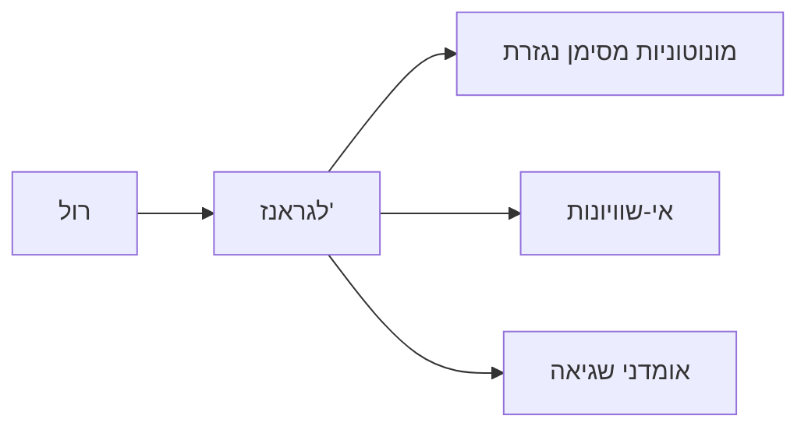

# משפט לגראנז' — משפט הערך הממוצע

> מקור: כרך ג, סעיף 8.2.2 (משפט 8.6, משפטים 8.7–8.8)

## המשפט (8.6)

אם $f$ רציפה ב-$[a,b]$ וגזירה ב-$(a,b)$, קיימת $c\in(a,b)$ שבה:
$$f'(c) = \frac{f(b)-f(a)}{b-a}$$

**איפשהו — המהירות הרגעית שווה למהירות הממוצעת.** גאומטרית: יש נקודה שבה המשיק מקביל למיתר המחבר את קצות הגרף.

## ההוכחה — הטיה + רול

מחסרים מ-$f$ את המיתר:
$$g(x) = f(x) - \left[f(a) + \frac{f(b)-f(a)}{b-a}(x-a)\right]$$
$g$ רציפה, גזירה, ו-$g(a)=g(b)=0$ ⟹ [[משפט רול]] נותן $g'(c)=0$, כלומר $f'(c)=\frac{f(b)-f(a)}{b-a}$. ∎

## המסקנות המבניות (משפטים 8.7–8.8)

- **נגזרת אפס ⟹ קבועה**: $f'\equiv0$ בקטע ⟹ $f$ קבועה שם. (לגראנז' על כל תת-קטע: כל שני ערכים שווים.)
- **נגזרות שוות ⟹ הפרש קבוע**: $f'=g'$ בקטע ⟹ $f=g+C$. זה הבסיס לכך שהפונקציה הקדומה יחידה עד כדי קבוע (אינפי 2).
- **סימן הנגזרת ⟹ מונוטוניות** (משפטים 8.17–8.18): $f'>0$ ⟹ עולה; $f'<0$ ⟹ יורדת — ראו [[מונוטוניות ומיון נקודות קיצון]].

⚠️ "קטע" חיוני: $f(x)=\frac{|x|}{x}$ על $(-1,0)\cup(0,1)$ — נגזרת אפס, לא קבועה (התחום לא קטע!).

## שימוש: הוכחת אי-שוויונות

לגראנז' חוסם את השינוי של פונקציה דרך חסם על הנגזרת: אם $m \le f' \le M$ בקטע אז
$$m(b-a) \le f(b)-f(a) \le M(b-a)$$
דוגמאות: $|\sin b - \sin a| \le |b-a|$ (כי $|\cos|\le1$); $\frac{x}{1+x} < \ln(1+x) < x$ עבור $x>0$.
פונקציה עם $|f'|\le K$ נקראת ליפשיצית — והיא בפרט [[רציפות במידה שווה ומשפט קנטור|רציפה במידה שווה]].

<!-- codex-enhanced: 2026-07-10 -->

## כרטיס דיוק

- **רעיון-על**: שיפוע מיתר על קטע מופיע כשיפוע משיק בנקודה פנימית.
- **מתי מפעילים**: באומדנים, הוכחת מונוטוניות, אי-שוויונות, ושליטה בהפרשי ערכים.
- **בדיקה עצמית**: הוכיחו $|\sin b-\sin a|\le |b-a|$ בעזרת לגראנז'.
- **מלכודת**: הנקודה $c$ מובטחת קיימת אבל בדרך כלל לא יודעים לחשב אותה במפורש.
- **קישור רוחב**: ראו גם [[מפת תלות משפטים - אינפי 1]], [[תבניות הוכחה באינפי 1]], [[אינדקס דוגמאות נגד - אינפי 1]].

## תרשים תלות

## קשרים

- [[משפט רול]] — המקרה הפרטי וגם מנוע ההוכחה
- [[משפט קושי]] — ההכללה לשתי פונקציות
- [[מונוטוניות ומיון נקודות קיצון]] — המסקנה החשובה ביותר
- [[משפט טיילור]] — לגראנז' = טיילור מסדר 0 עם שארית
- [[קמירות ונקודות פיתול]] — למת המיתרים מוכחת בלגראנז'
