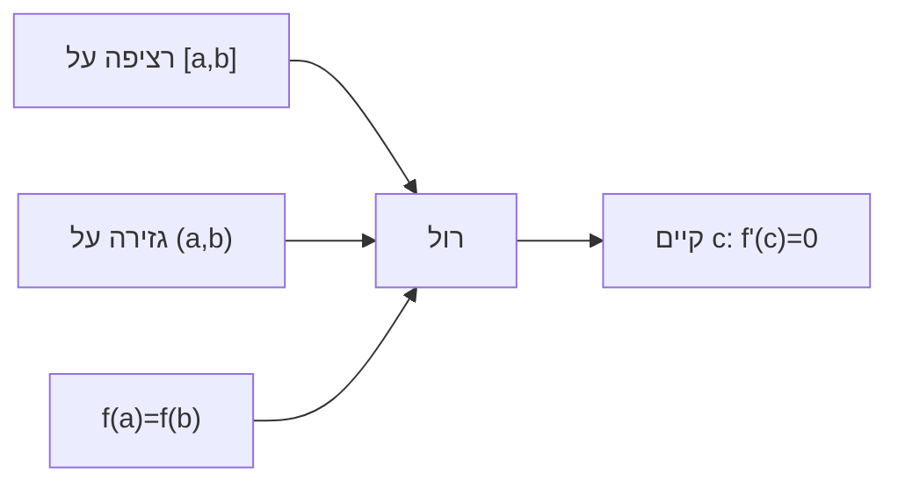

# משפט רול (Rolle)

> מקור: כרך ג, סעיף 8.2.1 (משפט 8.5)

## המשפט (8.5)

תהי $f$:
1. **רציפה** בקטע הסגור $[a,b]$
2. **גזירה** בקטע הפתוח $(a,b)$
3. $f(a) = f(b)$

אז קיימת נקודה $c \in (a,b)$ שבה:
$$f'(c) = 0$$

גאומטרית: גרף שמתחיל ומסיים באותו גובה — חייב איפשהו משיק אופקי. פיזיקלית: כדור שנזרק וחוזר לאותו גובה — היה רגע שמהירותו האנכית אפס.

## ההוכחה — שרשרת של שלושה משפטים

1. [[משפטי ויירשטראס|ויירשטראס השני]]: $f$ רציפה ב-$[a,b]$ ⟹ מקבלת מקסימום $M$ ומינימום $m$.
2. אם $M=m$: $f$ קבועה, ואז $f'\equiv0$ — כל נקודה מתאימה.
3. אחרת, אחד מהם שונה מ-$f(a)=f(b)$ ולכן מתקבל **בנקודה פנימית** $c$; שם [[נקודות קיצון ומשפט פרמה|משפט פרמה]]: $f'(c)=0$. ∎

## דיוק התנאים

- גזירות נדרשת רק **בפתוח**: $f(x)=\sqrt{1-x^2}$ על $[-1,1]$ — אין נגזרת בקצוות, רול עדיין עובד.
- כל תנאי הכרחי: $|x|$ על $[-1,1]$ (נכשלת גזירות בפנים — אין $c$); $f(x)=x-\lfloor x\rfloor$ עם אי-רציפות בקצה — אין $c$.

## שימוש אופייני: ספירת שורשים

**בין כל שני שורשים של $f$ יש שורש של $f'$.** מכאן: אם ל-$f'$ אין שורשים בקטע — ל-$f$ יש שם לכל היותר שורש אחד. משולב עם [[משפט ערך הביניים]] (שנותן קיום), מקבלים הוכחות "קיים ויחיד": למשל $x^3+3x-1=0$ — ערך ביניים נותן שורש, $f'=3x^2+3>0$ שולל שניים.

## תפקיד מבני

רול הוא "המקרה השטוח" שממנו נובע הכול: הטיית הגרף (חיסור ישר) הופכת אותו ל[[משפט לגראנז]]; הטיה מתוחכמת יותר — ל[[משפט קושי]]; והפעלה חוזרת $n$ פעמים — ל[[משפט טיילור|שארית לגראנז' בטיילור]].

<!-- codex-enhanced: 2026-07-10 -->

## כרטיס דיוק

- **רעיון-על**: אם פונקציה חוזרת לאותו גובה בקצוות, חייבת להיות נקודה עם שיפוע אפס.
- **מתי מפעילים**: בהוכחת לגראנז', ספירת שורשים, והוכחת קיום נקודת נגזרת אפס.
- **בדיקה עצמית**: הראו שאם לפולינום יש שני שורשים שונים אז לנגזרת יש שורש ביניהם.
- **מלכודת**: כל תנאי חשוב: רציפות על סגור, גזירות בפנים, ושוויון ערכים בקצוות.
- **קישור רוחב**: ראו גם [[מפת תלות משפטים - אינפי 1]], [[תבניות הוכחה באינפי 1]], [[אינדקס דוגמאות נגד - אינפי 1]].

## תרשים תנאים

## קשרים

- [[משפטי ויירשטראס]] + [[נקודות קיצון ומשפט פרמה]] — לבני ההוכחה
- [[משפט לגראנז]] — ההכללה המיידית
- [[משפט קושי]], [[משפט טיילור]] — הכללות נוספות
