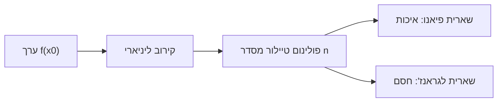

# משפט טיילור

> מקור: סיכום צנזור (אינפי 1מ, טכניון 104031), הרצאות 48–51. **לא נכלל בקורס 20474 של האו"פ** (שם — באינפי 2), אך משלים טבעי ליחידות 7–8.

## הרעיון: לשפר את הקירוב הליניארי

[[קירוב ליניארי והדיפרנציאל|המשיק]] הוא הפולינום מדרגה 1 שמתלכד עם $f$ בערך ובנגזרת ב-$x_0$, והשגיאה $o(x-x_0)$. הכללה: לדרוש התלכדות גם בנגזרות גבוהות.

## פולינום טיילור

**טענת עזר**: אם $P_n(x)=\sum \beta_k (x-x_0)^k$ אז $P_n^{(k)}(x_0) = \beta_k \cdot k!$. לכן הפולינום היחיד מדרגה $\le n$ המקיים $P_n^{(k)}(x_0)=f^{(k)}(x_0)$ לכל $0\le k\le n$ הוא:

$$P_n(x) = f(x_0) + \frac{f'(x_0)}{1!}(x-x_0) + \frac{f''(x_0)}{2!}(x-x_0)^2 + \cdots + \frac{f^{(n)}(x_0)}{n!}(x-x_0)^n$$

כאשר $x_0=0$ — **פולינום מקלורן**. דוגמאות מרכזיות (סביב 0):
$$e^x:\ \sum_{k=0}^n\frac{x^k}{k!} \qquad \sin x:\ x-\frac{x^3}{3!}+\frac{x^5}{5!}-\cdots \qquad \ln(1+x):\ x-\frac{x^2}2+\frac{x^3}3-\cdots$$

## משפט טיילור — צורת פיאנו (שארית איכותית)

אם $f$ גזירה $n$ פעמים ב-$x_0$, אז עבור $R_n(x) = f(x) - P_n(x)$:
$$\lim_{x\to x_0}\frac{R_n(x)}{(x-x_0)^n} = 0 \qquad\text{כלומר } R_n(x)=o\big((x-x_0)^n\big)$$
$P_n$ מקרב את $f$ טוב יותר מכל פולינום אחר מאותה דרגה. (הכללת [[קירוב ליניארי והדיפרנציאל|משפט 7.35]], שהוא המקרה $n=1$.)

## צורת לגראנז' (שארית כמותית)

אם $f$ גזירה $n+1$ פעמים בסביבה, קיימת $c$ בין $x_0$ ל-$x$:
$$R_n(x) = \frac{f^{(n+1)}(c)}{(n+1)!}(x-x_0)^{n+1}$$
המקרה $n=0$ הוא בדיוק [[משפט לגראנז]]; ההוכחה — הפעלות חוזרות של [[משפט רול]]/[[משפט קושי]].

### התכנסות השארית (הרצאה 51)
אם כל הנגזרות חסומות במשותף ($|f^{(n)}|\le K$ בסביבה), אז $R_n(x)\to0$ לכל $x$ — כי $\frac{K|x-x_0|^{n+1}}{(n+1)!}\to0$ ([[סדרי גודל ומבחן המנה|עצרת מנצחת חזקה]]). כך $e^x$ ($K=e^b$) ו-$\sin x$ ($K=1$).
⚠️ נגד-דוגמה: $f(x)=e^{-1/x^2}$ ($f(0)=0$) — כל הנגזרות מתאפסות ב-0, $P_n\equiv0$, והשארית לא שואפת לאפס לשום $x\ne0$.

## שימושים

1. **חישוב גבולות** (הרצאה 50): $\lim_{x\to0}\dfrac{\sin x - x}{x^3} = \lim\dfrac{-\frac{x^3}6+o(x^4)}{x^3} = -\dfrac16$ — לרוב מהיר מ[[כלל לופיטל]] כפול.
2. **חישובים מקורבים עם שגיאה חסומה**: $\sin\frac\pi4$ עם $P_5$ מדויק ל-4 ספרות; שארית לגראנז' נותנת חסם מפורש.
3. **[[מונוטוניות ומיון נקודות קיצון|מבחן הנגזרת ה-n-ית]]**: הסימן של הגורם הראשון שלא מתאפס קובע קיצון/פיתול.
4. **הוכחת אי-שוויונות**: $e^x \ge 1+x+\frac{x^2}2$ ל-$x\ge0$ וכד'.

<!-- codex-enhanced: 2026-07-10 -->

## כרטיס דיוק

- **רעיון-על**: טיילור מחליף פונקציה בפולינום שמסכים איתה בנגזרות, עם שארית שמודדת טעות.
- **מתי מפעילים**: בקירובים, גבולות, פיתוחים מקומיים, והשוואה ללופיטל.
- **בדיקה עצמית**: פתחו $\sin x$ סביב $0$ עד סדר 5 והשתמשו בשארית כדי להעריך טעות ליד $0$.
- **מלכודת**: פולינום טיילור לא תמיד מתכנס לפונקציה גם אם כל הנגזרות קיימות.
- **קישור רוחב**: ראו גם [[מפת תלות משפטים - אינפי 1]], [[תבניות הוכחה באינפי 1]], [[אינדקס דוגמאות נגד - אינפי 1]].

## תרשים קירובים

## קשרים

- [[קירוב ליניארי והדיפרנציאל]] — המקרה $n=1$
- [[משפט לגראנז]], [[משפט רול]], [[משפט קושי]] — התשתית
- [[כלל לופיטל]] — הכלי המתחרה לגבולות
- [[סדרי גודל ומבחן המנה]] — למה השארית דועכת
